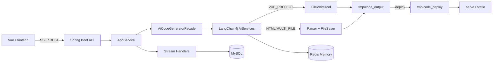

<!-- Generated by SpecStory, Markdown v2.1.0 -->

# 2026-08-02 14:47:00Z

<!-- Cursor IDE Session 4cf80e77-f832-4c2c-b4ca-27c5e71ad7b5 (2026-08-02 14:47:00Z) -->

_**User**_

Explore the repository at d:\Liyalin\javafail\hive-ai-code-mother with "medium" thoroughness.

I need a grounded overview of this project so I can brainstorm next steps with the user. Please report back:

1. What the project does at a high level (read README if present, and the main Spring Boot application class).
2. The package/module structure under src/main/java/com/hive/hiveaicodemother — list the main packages and what each is responsible for (ai, core, controller, service, model, etc.).
3. Key features already implemented: what AI code generation modes exist (look at CodeGenTypeEnum or similar), how streaming works (look at core/AiCodeGeneratorFacade.java, core/handler/*), what tools the AI has available (look for any @Tool annotated classes or a tools package).
4. Any obvious TODOs, unfinished work, or stubbed-out functionality (search for TODO/FIXME comments).
5. The tech stack: read pom.xml and list the major dependencies and versions (Spring Boot version, LangChain4j version, database, cache, etc.).
6. Whether there is a frontend directory, and if so what framework it uses.
7. What tests exist under src/test, if any.

Be concrete and cite file paths. Do not modify any files.

---

_**Agent (composer-2.5)**_

Exploring the repository structure, docs, and key implementation areas for a grounded overview.


_**Agent (composer-2.5)**_

<tool-use data-tool-type="unknown" data-tool-name="update_current_step"><details>
<summary>Tool use: **update_current_step**</summary>
An unknown error occurred
</details></tool-use>

_**Agent (composer-2.5)**_

<tool-use data-tool-type="search" data-tool-name="glob_file_search"><details>
<summary>Tool use: **glob_file_search** • Searched codebase "" • **1** result in **1** directory</summary>

Directory: **`d:\Liyalin\javafail\hive-ai-code-mother`** (1 file)

| File |
|------|
| `../src/main/java/com/hive/hiveaicodemother/HiveAiCodeMotherApplication.java` |
</details></tool-use>

_**Agent (composer-2.5)**_

<tool-use data-tool-type="search" data-tool-name="glob_file_search"><details>
<summary>Tool use: **glob_file_search** • Searched codebase "" • **1** result in **1** directory</summary>

Directory: **`d:\Liyalin\javafail\hive-ai-code-mother`** (1 file)

| File |
|------|
| `../pom.xml` |
</details></tool-use>

_**Agent (composer-2.5)**_

<tool-use data-tool-type="search" data-tool-name="glob_file_search"><details>
<summary>Tool use: **glob_file_search** • Searched codebase "" • **7** results in **1** directory</summary>

Directory: **`d:\Liyalin\javafail\hive-ai-code-mother\src\test`** (7 files)

| File |
|------|
| `../src/test/java/com/hive/hiveaicodemother/controller/AppControllerTest.java` |
| `../src/test/java/com/hive/hiveaicodemother/core/AiCodeGeneratorFacadeTest.java` |
| `../src/test/java/com/hive/hiveaicodemother/HiveAiCodeMotherApplicationTests.java` |
| `../src/test/java/com/hive/hiveaicodemother/ai/AiCodeGeneratorServiceFactoryTest.java` |
| `../src/test/java/com/hive/hiveaicodemother/ai/AiCodeGeneratorServiceTest.java` |
| `../src/test/java/com/hive/hiveaicodemother/core/CodeParserTest.java` |
| `../src/test/java/com/hive/hiveaicodemother/core/saver/CodeFileSaverTemplateTest.java` |
</details></tool-use>

_**Agent (composer-2.5)**_

<tool-use data-tool-type="unknown" data-tool-name="ripgrep_raw_search"><details>
<summary>Tool use: **ripgrep_raw_search**</summary>

Parameters:

```json
{
  "caseInsensitive": false,
  "glob": "*.{java,ts,tsx,js,vue}",
  "path": "d:\\Liyalin\\javafail\\hive-ai-code-mother",
  "pattern": "TODO|FIXME"
}
```
Additional data:

```json
{
  "isPruned": true,
  "outputMode": "content",
  "path": "d:\\Liyalin\\javafail\\hive-ai-code-mother",
  "pattern": "TODO|FIXME",
  "topFiles": [
    {
      "matchCount": 1,
      "uri": "node_modules/onetime/index.js"
    },
    {
      "matchCount": 1,
      "uri": "node_modules/mimic-fn/index.d.ts"
    },
    {
      "matchCount": 1,
      "uri": "node_modules/ajv/dist/vocabularies/dynamic/dynamicRef.js"
    },
    {
      "matchCount": 1,
      "uri": "node_modules/ajv/dist/compile/validate/subschema.js"
    },
    {
      "matchCount": 1,
      "uri": "node_modules/cli-boxes/index.js"
    },
    {
      "matchCount": 1,
      "uri": "node_modules/ajv/lib/vocabularies/format/format.ts"
    },
    {
      "matchCount": 1,
      "uri": "node_modules/mimic-fn/index.js"
    },
    {
      "matchCount": 1,
      "uri": "node_modules/chalk/source/utilities.js"
    },
    {
      "matchCount": 1,
      "uri": "src/main/java/dev/langchain4j/model/openai/OpenAiStreamingResponseBuilder.java"
    },
    {
      "matchCount": 8,
      "uri": "node_modules/ajv/dist/compile/index.js"
    },
    {
      "matchCount": 1,
      "uri": "node_modules/ajv/lib/compile/codegen/code.ts"
    },
    {
      "matchCount": 3,
      "uri": "node_modules/ajv/lib/vocabularies/applicator/dependencies.ts"
    },
    {
      "matchCount": 1,
      "uri": "node_modules/ajv/lib/compile/validate/dataType.ts"
    },
    {
      "matchCount": 1,
      "uri": "node_modules/ajv/lib/compile/validate/keyword.ts"
    },
    {
      "matchCount": 1,
      "uri": "node_modules/ajv/lib/compile/jtd/parse.ts"
    },
    {
      "matchCount": 2,
      "uri": "node_modules/ajv/lib/compile/util.ts"
    },
    {
      "matchCount": 1,
      "uri": "node_modules/ajv/dist/vocabularies/applicator/additionalProperties.js"
    },
    {
      "matchCount": 3,
      "uri": "node_modules/ajv/lib/compile/validate/boolSchema.ts"
    },
    {
      "matchCount": 1,
      "uri": "node_modules/npm-run-path/index.js"
    },
    {
      "matchCount": 1,
      "uri": "node_modules/ajv/dist/compile/validate/keyword.js"
    }
  ],
  "totalFiles": 67,
  "totalMatches": 135
}
```
Status: **completed**

</details></tool-use>

_**Agent (composer-2.5)**_

<tool-use data-tool-type="search" data-tool-name="glob_file_search"><details>
<summary>Tool use: **glob_file_search** • Searched codebase "" • **85** results in **1** directory</summary>

Directory: **`d:\Liyalin\javafail\hive-ai-code-mother`** (85 files)

| File |
|------|
| `../node_modules/get-stream/readme.md` |
| `../node_modules/mime-types/node_modules/mime-db/README.md` |
| `../node_modules/widest-line/readme.md` |
| `../node_modules/balanced-match/README.md` |
| `../node_modules/shebang-regex/readme.md` |
| `../node_modules/minimist/README.md` |
| `../node_modules/eastasianwidth/README.md` |
| `../node_modules/on-headers/README.md` |
| `../node_modules/npm-run-path/readme.md` |
| `../node_modules/clipboardy/readme.md` |
| `../node_modules/emoji-regex/README.md` |
| `../node_modules/compression/README.md` |
| `../node_modules/ini/README.md` |
| `../node_modules/safe-buffer/README.md` |
| `../node_modules/wrap-ansi/readme.md` |
| `../node_modules/deep-extend/README.md` |
| `../node_modules/compressible/README.md` |
| `../node_modules/ajv/README.md` |
| `../node_modules/has-flag/readme.md` |
| `../node_modules/strip-final-newline/readme.md` |
| `../node_modules/is-docker/readme.md` |
| `../node_modules/mime-types/README.md` |
| `../node_modules/registry-auth-token/README.md` |
| `../node_modules/registry-url/readme.md` |
| `../node_modules/ansi-styles/readme.md` |
| `../node_modules/arch/README.md` |
| `../node_modules/strip-json-comments/readme.md` |
| `../node_modules/ms/readme.md` |
| `../node_modules/type-fest/readme.md` |
| `../node_modules/update-check/README.md` |
| `../node_modules/ansi-align/node_modules/emoji-regex/README.md` |
| `../node_modules/arg/README.md` |
| `../node_modules/concat-map/README.markdown` |
| `../node_modules/content-disposition/README.md` |
| `../node_modules/fast-deep-equal/README.md` |
| `../node_modules/@zeit/schemas/README.md` |
| `../node_modules/strip-ansi/readme.md` |
| `../node_modules/is-stream/readme.md` |
| `../node_modules/signal-exit/README.md` |
| `../node_modules/chalk-template/node_modules/chalk/readme.md` |
| `../node_modules/serve-handler/node_modules/bytes/Readme.md` |
| `../node_modules/execa/readme.md` |
| `../node_modules/string-width/readme.md` |
| `../node_modules/mime-db/README.md` |
| `../node_modules/camelcase/readme.md` |
| `../node_modules/ansi-align/node_modules/ansi-regex/readme.md` |
| `../node_modules/fast-uri/README.md` |
| `../node_modules/negotiator/README.md` |
| `../node_modules/rc/README.md` |
| `../node_modules/serve-handler/README.md` |
| `../node_modules/path-to-regexp/Readme.md` |
| `../node_modules/chalk/readme.md` |
| `../node_modules/is-port-reachable/readme.md` |
| `../node_modules/merge-stream/README.md` |
| `../node_modules/ansi-align/README.md` |
| `../node_modules/is-wsl/readme.md` |
| `../node_modules/isexe/README.md` |
| `../node_modules/minimatch/README.md` |
| `../hive-ai-code-mother-frontend/README.md` |
| `../node_modules/onetime/readme.md` |
| `../node_modules/which/README.md` |
| `../node_modules/chalk-template/readme.md` |
| `../node_modules/mimic-fn/readme.md` |
| `../node_modules/debug/README.md` |
| `../node_modules/json-schema-traverse/README.md` |
| `../node_modules/path-key/readme.md` |
| `../node_modules/ansi-align/node_modules/strip-ansi/readme.md` |
| `../node_modules/ansi-regex/readme.md` |
| `../node_modules/color-name/README.md` |
| `../node_modules/color-convert/README.md` |
| `../node_modules/cross-spawn/README.md` |
| `../node_modules/range-parser/README.md` |
| `../node_modules/serve/readme.md` |
| `../node_modules/human-signals/README.md` |
| `../node_modules/brace-expansion/README.md` |
| `../node_modules/boxen/readme.md` |
| `../node_modules/vary/README.md` |
| `../node_modules/ansi-align/node_modules/string-width/readme.md` |
| `../node_modules/is-fullwidth-code-point/readme.md` |
| `../node_modules/cli-boxes/readme.md` |
| `../node_modules/require-from-string/readme.md` |
| `../node_modules/bytes/Readme.md` |
| `../node_modules/shebang-command/readme.md` |
| `../node_modules/supports-color/readme.md` |
| `../node_modules/chalk-template/node_modules/ansi-styles/readme.md` |
</details></tool-use>

_**Agent (composer-2.5)**_

<tool-use data-tool-type="search" data-tool-name="glob_file_search"><details>
<summary>Tool use: **glob_file_search** • Searched codebase "" • **77** results in **1** directory</summary>

Directory: **`d:\Liyalin\javafail\hive-ai-code-mother\src\main\java\com\hive\hiveaicodemother`** (77 files)

| File |
|------|
| `../src/main/java/com/hive/hiveaicodemother/common/BaseResponse.java` |
| `../src/main/java/com/hive/hiveaicodemother/core/parser/MultiFileCodeParser.java` |
| `../src/main/java/com/hive/hiveaicodemother/exception/GlobalExceptionHandler.java` |
| `../src/main/java/com/hive/hiveaicodemother/exception/ThrowUtils.java` |
| `../src/main/java/com/hive/hiveaicodemother/model/dto/user/UserAddRequest.java` |
| `../src/main/java/com/hive/hiveaicodemother/model/dto/app/AppAddRequest.java` |
| `../src/main/java/com/hive/hiveaicodemother/model/entity/User.java` |
| `../src/main/java/com/hive/hiveaicodemother/core/parser/HtmlCodeParser.java` |
| `../src/main/java/com/hive/hiveaicodemother/core/CodeParser.java` |
| `../src/main/java/com/hive/hiveaicodemother/config/RedisChatMemoryStoreConfig.java` |
| `../src/main/java/com/hive/hiveaicodemother/ai/model/MultiFileCodeResult.java` |
| `../src/main/java/com/hive/hiveaicodemother/model/entity/App.java` |
| `../src/main/java/com/hive/hiveaicodemother/model/vo/AppVO.java` |
| `../src/main/java/com/hive/hiveaicodemother/model/dto/app/AppUpdateRequest.java` |
| `../src/main/java/com/hive/hiveaicodemother/controller/HealthController.java` |
| `../src/main/java/com/hive/hiveaicodemother/core/CodeFileSaver.java` |
| `../src/main/java/com/hive/hiveaicodemother/model/dto/user/UserQueryRequest.java` |
| `../src/main/java/com/hive/hiveaicodemother/model/enums/UserRoleEnum.java` |
| `../src/main/java/com/hive/hiveaicodemother/HiveAiCodeMotherApplication.java` |
| `../src/main/java/com/hive/hiveaicodemother/core/saver/HtmlCodeFileSaverTemplate.java` |
| `../src/main/java/com/hive/hiveaicodemother/service/AppService.java` |
| `../src/main/java/com/hive/hiveaicodemother/model/entity/ChatHistory.java` |
| `../src/main/java/com/hive/hiveaicodemother/generator/MyBatisCodeGenerator.java` |
| `../src/main/java/com/hive/hiveaicodemother/ai/model/message/StreamMessage.java` |
| `../src/main/java/com/hive/hiveaicodemother/exception/ErrorCode.java` |
| `../src/main/java/com/hive/hiveaicodemother/ai/model/message/StreamMessageTypeEnum.java` |
| `../src/main/java/com/hive/hiveaicodemother/core/handler/JsonMessageStreamHandler.java` |
| `../src/main/java/com/hive/hiveaicodemother/model/dto/chathistory/ChatHistoryQueryRequest.java` |
| `../src/main/java/com/hive/hiveaicodemother/model/dto/user/UserUpdateRequest.java` |
| `../src/main/java/com/hive/hiveaicodemother/mapper/UserMapper.java` |
| `../src/main/java/com/hive/hiveaicodemother/common/PageRequest.java` |
| `../src/main/java/com/hive/hiveaicodemother/ai/tools/FileWriteTool.java` |
| `../src/main/java/com/hive/hiveaicodemother/core/saver/MultiFileCodeFileSaverTemplate.java` |
| `../src/main/java/com/hive/hiveaicodemother/common/DeleteRequest.java` |
| `../src/main/java/com/hive/hiveaicodemother/controller/ChatHistoryController.java` |
| `../src/main/java/com/hive/hiveaicodemother/model/vo/LoginUserVO.java` |
| `../src/main/java/com/hive/hiveaicodemother/ai/AiCodeGeneratorService.java` |
| `../src/main/java/com/hive/hiveaicodemother/config/ReasoningStreamingChatModelConfig.java` |
| `../src/main/java/com/hive/hiveaicodemother/model/dto/app/AppDeployRequest.java` |
| `../src/main/java/com/hive/hiveaicodemother/constant/AppConstant.java` |
| `../src/main/java/com/hive/hiveaicodemother/service/impl/ChatHistoryServiceImpl.java` |
| `../src/main/java/com/hive/hiveaicodemother/core/AiCodeGeneratorFacade.java` |
| `../src/main/java/com/hive/hiveaicodemother/ai/model/HtmlCodeResult.java` |
| `../src/main/java/com/hive/hiveaicodemother/ai/AiCodeGeneratorServiceFactory.java` |
| `../src/main/java/com/hive/hiveaicodemother/core/saver/CodeFileSaverTemplate.java` |
| `../src/main/java/com/hive/hiveaicodemother/core/handler/StreamHandlerExecutor.java` |
| `../src/main/java/com/hive/hiveaicodemother/service/impl/AppServiceImpl.java` |
| `../src/main/java/com/hive/hiveaicodemother/constant/UserConstant.java` |
| `../src/main/java/com/hive/hiveaicodemother/aop/AuthInterceptor.java` |
| `../src/main/java/com/hive/hiveaicodemother/core/parser/CodeParserExecutor.java` |
| `../src/main/java/com/hive/hiveaicodemother/ai/memory/RedisTemplateChatMemoryStore.java` |
| `../src/main/java/com/hive/hiveaicodemother/ai/model/message/ToolExecutedMessage.java` |
| `../src/main/java/com/hive/hiveaicodemother/annotation/AuthCheck.java` |
| `../src/main/java/com/hive/hiveaicodemother/common/ResultUtils.java` |
| `../src/main/java/com/hive/hiveaicodemother/service/UserService.java` |
| `../src/main/java/com/hive/hiveaicodemother/controller/UserController.java` |
| `../src/main/java/com/hive/hiveaicodemother/core/saver/CodeFileSaverExecutor.java` |
| `../src/main/java/com/hive/hiveaicodemother/model/vo/UserVO.java` |
| `../src/main/java/com/hive/hiveaicodemother/ai/model/message/AiResponseMessage.java` |
| `../src/main/java/com/hive/hiveaicodemother/ai/model/message/ToolRequestMessage.java` |
| `../src/main/java/com/hive/hiveaicodemother/mapper/AppMapper.java` |
| `../src/main/java/com/hive/hiveaicodemother/config/CorsConfig.java` |
| `../src/main/java/com/hive/hiveaicodemother/model/enums/ChatHistoryMessageTypeEnum.java` |
| `../src/main/java/com/hive/hiveaicodemother/model/dto/app/AppAdminUpdateRequest.java` |
| `../src/main/java/com/hive/hiveaicodemother/controller/AppController.java` |
| `../src/main/java/com/hive/hiveaicodemother/service/ChatHistoryService.java` |
| `../src/main/java/com/hive/hiveaicodemother/model/dto/app/AppQueryRequest.java` |
| `../src/main/java/com/hive/hiveaicodemother/model/dto/user/UserRegisterRequest.java` |
| `../src/main/java/com/hive/hiveaicodemother/controller/StaticResourceController.java` |
| `../src/main/java/com/hive/hiveaicodemother/model/enums/CodeGenTypeEnum.java` |
| `../src/main/java/com/hive/hiveaicodemother/core/parser/CodeParser.java` |
| `../src/main/java/com/hive/hiveaicodemother/model/dto/user/UserLoginRequest.java` |
| `../src/main/java/com/hive/hiveaicodemother/mapper/ChatHistoryMapper.java` |
| `../src/main/java/com/hive/hiveaicodemother/core/handler/SimpleTextStreamHandler.java` |
| `../src/main/java/com/hive/hiveaicodemother/core/builder/VueProjectBuilder.java` |
| `../src/main/java/com/hive/hiveaicodemother/service/impl/UserServiceImpl.java` |
| `../src/main/java/com/hive/hiveaicodemother/exception/BusinessException.java` |
</details></tool-use>

_**Agent (composer-2.5)**_

<tool-use data-tool-type="search" data-tool-name="glob_file_search"><details>
<summary>Tool use: **glob_file_search** • Searched codebase "" • **90** results in **1** directory</summary>

Directory: **`d:\Liyalin\javafail\hive-ai-code-mother`** (90 files)

| File |
|------|
| `../node_modules/camelcase/package.json` |
| `../node_modules/registry-auth-token/package.json` |
| `../node_modules/npm-run-path/package.json` |
| `../node_modules/bytes/package.json` |
| `../node_modules/human-signals/package.json` |
| `../node_modules/type-fest/package.json` |
| `../node_modules/compression/package.json` |
| `../node_modules/fast-deep-equal/package.json` |
| `../node_modules/ansi-align/node_modules/ansi-regex/package.json` |
| `../node_modules/boxen/package.json` |
| `../node_modules/on-headers/package.json` |
| `../node_modules/fast-uri/package.json` |
| `../node_modules/string-width/package.json` |
| `../node_modules/cli-boxes/package.json` |
| `../node_modules/ms/package.json` |
| `../node_modules/compressible/package.json` |
| `../node_modules/color-convert/package.json` |
| `../node_modules/onetime/package.json` |
| `../node_modules/registry-url/package.json` |
| `../node_modules/widest-line/package.json` |
| `../node_modules/path-to-regexp/package.json` |
| `../node_modules/minimatch/package.json` |
| `../node_modules/fast-uri/benchmark/package.json` |
| `../node_modules/require-from-string/package.json` |
| `../node_modules/chalk-template/node_modules/ansi-styles/package.json` |
| `../node_modules/arch/package.json` |
| `../node_modules/ansi-align/node_modules/strip-ansi/package.json` |
| `../node_modules/mime-types/node_modules/mime-db/package.json` |
| `../node_modules/signal-exit/package.json` |
| `../node_modules/chalk-template/package.json` |
| `../node_modules/cross-spawn/package.json` |
| `../node_modules/is-docker/package.json` |
| `../node_modules/path-key/package.json` |
| `../node_modules/safe-buffer/package.json` |
| `../node_modules/strip-ansi/package.json` |
| `../node_modules/debug/package.json` |
| `../node_modules/ini/package.json` |
| `../node_modules/negotiator/package.json` |
| `../node_modules/strip-json-comments/package.json` |
| `../node_modules/brace-expansion/dist/commonjs/package.json` |
| `../node_modules/ajv/package.json` |
| `../node_modules/balanced-match/package.json` |
| `../node_modules/is-fullwidth-code-point/package.json` |
| `../node_modules/serve/package.json` |
| `../package.json` |
| `../node_modules/update-check/package.json` |
| `../node_modules/ansi-align/node_modules/string-width/package.json` |
| `../node_modules/serve-handler/node_modules/bytes/package.json` |
| `../hive-ai-code-mother-frontend/package.json` |
| `../node_modules/eastasianwidth/package.json` |
| `../node_modules/concat-map/package.json` |
| `../node_modules/has-flag/package.json` |
| `../node_modules/ansi-styles/package.json` |
| `../node_modules/ansi-align/package.json` |
| `../node_modules/color-name/package.json` |
| `../node_modules/is-port-reachable/package.json` |
| `../node_modules/is-wsl/package.json` |
| `../node_modules/ansi-regex/package.json` |
| `../node_modules/path-is-inside/package.json` |
| `../node_modules/rc/package.json` |
| `../node_modules/vary/package.json` |
| `../node_modules/get-stream/package.json` |
| `../node_modules/execa/package.json` |
| `../node_modules/mime-types/package.json` |
| `../node_modules/chalk/package.json` |
| `../node_modules/mimic-fn/package.json` |
| `../node_modules/content-disposition/package.json` |
| `../node_modules/minimist/package.json` |
| `../node_modules/range-parser/package.json` |
| `../node_modules/which/package.json` |
| `../node_modules/ansi-align/node_modules/emoji-regex/package.json` |
| `../node_modules/brace-expansion/dist/esm/package.json` |
| `../node_modules/shebang-command/package.json` |
| `../node_modules/json-schema-traverse/package.json` |
| `../node_modules/mime-db/package.json` |
| `../node_modules/chalk-template/node_modules/chalk/package.json` |
| `../node_modules/supports-color/package.json` |
| `../node_modules/clipboardy/package.json` |
| `../node_modules/is-stream/package.json` |
| `../node_modules/serve-handler/package.json` |
| `../node_modules/wrap-ansi/package.json` |
| `../node_modules/brace-expansion/package.json` |
| `../node_modules/deep-extend/package.json` |
| `../node_modules/isexe/package.json` |
| `../node_modules/merge-stream/package.json` |
| `../node_modules/shebang-regex/package.json` |
| `../node_modules/@zeit/schemas/package.json` |
| `../node_modules/arg/package.json` |
| `../node_modules/strip-final-newline/package.json` |
| `../node_modules/emoji-regex/package.json` |
</details></tool-use>

_**Agent (composer-2.5)**_

<tool-use data-tool-type="read" data-tool-name="read_file_v2"><details>
<summary>Tool use: **read_file_v2** • Read file: d:\Liyalin\javafail\hive-ai-code-mother\pom.xml</summary>

</details></tool-use>

_**Agent (composer-2.5)**_

<tool-use data-tool-type="read" data-tool-name="read_file_v2"><details>
<summary>Tool use: **read_file_v2** • Read file: d:\Liyalin\javafail\hive-ai-code-mother\src\main\java\com\hive\hiveaicodemother\HiveAiCodeMotherApplication.java</summary>

</details></tool-use>

_**Agent (composer-2.5)**_

<tool-use data-tool-type="read" data-tool-name="read_file_v2"><details>
<summary>Tool use: **read_file_v2** • Read file: d:\Liyalin\javafail\hive-ai-code-mother\hive-ai-code-mother-frontend\package.json</summary>

</details></tool-use>

_**Agent (composer-2.5)**_

<tool-use data-tool-type="read" data-tool-name="read_file_v2"><details>
<summary>Tool use: **read_file_v2** • Read file: d:\Liyalin\javafail\hive-ai-code-mother\hive-ai-code-mother-frontend\README.md</summary>

</details></tool-use>

_**Agent (composer-2.5)**_

<tool-use data-tool-type="unknown" data-tool-name="ripgrep_raw_search"><details>
<summary>Tool use: **ripgrep_raw_search**</summary>

Parameters:

```json
{
  "caseInsensitive": false,
  "path": "d:\\Liyalin\\javafail\\hive-ai-code-mother\\src",
  "pattern": "CodeGenType"
}
```
Additional data:

```json
{
  "isPruned": true,
  "outputMode": "content",
  "path": "d:\\Liyalin\\javafail\\hive-ai-code-mother\\src",
  "pattern": "CodeGenType",
  "topFiles": [
    {
      "matchCount": 2,
      "uri": "src/main/java/com/hive/hiveaicodemother/core/handler/StreamHandlerExecutor.java"
    },
    {
      "matchCount": 8,
      "uri": "src/main/java/com/hive/hiveaicodemother/core/AiCodeGeneratorFacade.java"
    },
    {
      "matchCount": 3,
      "uri": "src/main/java/com/hive/hiveaicodemother/core/saver/HtmlCodeFileSaverTemplate.java"
    },
    {
      "matchCount": 2,
      "uri": "src/main/java/com/hive/hiveaicodemother/core/saver/CodeFileSaverExecutor.java"
    },
    {
      "matchCount": 2,
      "uri": "src/main/java/com/hive/hiveaicodemother/core/saver/CodeFileSaverTemplate.java"
    },
    {
      "matchCount": 5,
      "uri": "src/main/java/com/hive/hiveaicodemother/ai/AiCodeGeneratorServiceFactory.java"
    },
    {
      "matchCount": 3,
      "uri": "src/main/java/com/hive/hiveaicodemother/core/saver/MultiFileCodeFileSaverTemplate.java"
    },
    {
      "matchCount": 2,
      "uri": "src/main/java/com/hive/hiveaicodemother/controller/AppController.java"
    },
    {
      "matchCount": 2,
      "uri": "src/main/java/com/hive/hiveaicodemother/core/parser/CodeParserExecutor.java"
    },
    {
      "matchCount": 4,
      "uri": "src/main/java/com/hive/hiveaicodemother/model/enums/CodeGenTypeEnum.java"
    },
    {
      "matchCount": 7,
      "uri": "src/main/java/com/hive/hiveaicodemother/service/impl/AppServiceImpl.java"
    },
    {
      "matchCount": 3,
      "uri": "src/main/java/com/hive/hiveaicodemother/core/CodeFileSaver.java"
    },
    {
      "matchCount": 3,
      "uri": "src/test/java/com/hive/hiveaicodemother/core/AiCodeGeneratorFacadeTest.java"
    }
  ],
  "totalFiles": 13,
  "totalMatches": 46
}
```
Status: **completed**

</details></tool-use>

_**Agent (composer-2.5)**_

<tool-use data-tool-type="unknown" data-tool-name="ripgrep_raw_search"><details>
<summary>Tool use: **ripgrep_raw_search**</summary>

Parameters:

```json
{
  "caseInsensitive": false,
  "path": "d:\\Liyalin\\javafail\\hive-ai-code-mother\\src",
  "pattern": "@Tool"
}
```
Additional data:

```json
{
  "isPruned": true,
  "outputMode": "content",
  "path": "d:\\Liyalin\\javafail\\hive-ai-code-mother\\src",
  "pattern": "@Tool",
  "topFiles": [
    {
      "matchCount": 2,
      "uri": "src/main/java/com/hive/hiveaicodemother/ai/tools/FileWriteTool.java"
    }
  ],
  "totalFiles": 1,
  "totalMatches": 2
}
```
Status: **completed**

</details></tool-use>

_**Agent (composer-2.5)**_

<tool-use data-tool-type="unknown" data-tool-name="ripgrep_raw_search"><details>
<summary>Tool use: **ripgrep_raw_search**</summary>

Parameters:

```json
{
  "caseInsensitive": false,
  "path": "d:\\Liyalin\\javafail\\hive-ai-code-mother\\src",
  "pattern": "TODO|FIXME"
}
```
Additional data:

```json
{
  "isPruned": true,
  "outputMode": "content",
  "path": "d:\\Liyalin\\javafail\\hive-ai-code-mother\\src",
  "pattern": "TODO|FIXME",
  "topFiles": [
    {
      "matchCount": 4,
      "uri": "src/main/java/dev/langchain4j/internal/ToolExecutionRequestBuilder.java"
    },
    {
      "matchCount": 12,
      "uri": "src/main/java/dev/langchain4j/model/chat/response/StreamingChatResponseHandler.java"
    },
    {
      "matchCount": 1,
      "uri": "src/main/java/dev/langchain4j/service/AiServiceStreamingResponseHandler.java"
    },
    {
      "matchCount": 1,
      "uri": "src/main/java/dev/langchain4j/model/openai/OpenAiStreamingResponseBuilder.java"
    }
  ],
  "totalFiles": 4,
  "totalMatches": 18
}
```
Status: **completed**

</details></tool-use>

_**Agent (composer-2.5)**_

<tool-use data-tool-type="search" data-tool-name="glob_file_search"><details>
<summary>Tool use: **glob_file_search** • Searched codebase "" • **84** results in **1** directory</summary>

Directory: **`d:\Liyalin\javafail\hive-ai-code-mother`** (84 files)

| File |
|------|
| `../node_modules/serve/readme.md` |
| `../node_modules/ansi-align/README.md` |
| `../node_modules/@zeit/schemas/README.md` |
| `../node_modules/ms/readme.md` |
| `../node_modules/boxen/readme.md` |
| `../node_modules/fast-deep-equal/README.md` |
| `../node_modules/is-wsl/readme.md` |
| `../node_modules/ansi-regex/readme.md` |
| `../node_modules/color-convert/README.md` |
| `../node_modules/shebang-command/readme.md` |
| `../node_modules/type-fest/readme.md` |
| `../node_modules/ansi-align/node_modules/emoji-regex/README.md` |
| `../node_modules/shebang-regex/readme.md` |
| `../node_modules/serve-handler/node_modules/bytes/Readme.md` |
| `../node_modules/safe-buffer/README.md` |
| `../node_modules/bytes/Readme.md` |
| `../node_modules/ajv/README.md` |
| `../node_modules/content-disposition/README.md` |
| `../node_modules/ini/README.md` |
| `../node_modules/merge-stream/README.md` |
| `../node_modules/negotiator/README.md` |
| `../node_modules/strip-json-comments/readme.md` |
| `../node_modules/fast-uri/README.md` |
| `../node_modules/rc/README.md` |
| `../node_modules/ansi-align/node_modules/ansi-regex/readme.md` |
| `../node_modules/path-key/readme.md` |
| `../node_modules/string-width/readme.md` |
| `../node_modules/ansi-align/node_modules/string-width/readme.md` |
| `../node_modules/widest-line/readme.md` |
| `../node_modules/strip-final-newline/readme.md` |
| `../node_modules/strip-ansi/readme.md` |
| `../node_modules/eastasianwidth/README.md` |
| `../node_modules/compression/README.md` |
| `../node_modules/has-flag/readme.md` |
| `../node_modules/camelcase/readme.md` |
| `../node_modules/human-signals/README.md` |
| `../node_modules/mime-types/README.md` |
| `../node_modules/balanced-match/README.md` |
| `../node_modules/mime-types/node_modules/mime-db/README.md` |
| `../node_modules/debug/README.md` |
| `../node_modules/is-docker/readme.md` |
| `../node_modules/mimic-fn/readme.md` |
| `../node_modules/cli-boxes/readme.md` |
| `../node_modules/execa/readme.md` |
| `../node_modules/serve-handler/README.md` |
| `../node_modules/get-stream/readme.md` |
| `../node_modules/isexe/README.md` |
| `../node_modules/wrap-ansi/readme.md` |
| `../node_modules/arch/README.md` |
| `../node_modules/which/README.md` |
| `../node_modules/ansi-align/node_modules/strip-ansi/readme.md` |
| `../node_modules/on-headers/README.md` |
| `../node_modules/is-stream/readme.md` |
| `../node_modules/onetime/readme.md` |
| `../node_modules/registry-url/readme.md` |
| `../node_modules/brace-expansion/README.md` |
| `../node_modules/json-schema-traverse/README.md` |
| `../node_modules/emoji-regex/README.md` |
| `../node_modules/path-to-regexp/Readme.md` |
| `../node_modules/arg/README.md` |
| `../node_modules/is-fullwidth-code-point/readme.md` |
| `../node_modules/mime-db/README.md` |
| `../node_modules/deep-extend/README.md` |
| `../node_modules/clipboardy/readme.md` |
| `../node_modules/chalk/readme.md` |
| `../node_modules/ansi-styles/readme.md` |
| `../node_modules/compressible/README.md` |
| `../node_modules/is-port-reachable/readme.md` |
| `../node_modules/minimist/README.md` |
| `../node_modules/minimatch/README.md` |
| `../node_modules/npm-run-path/readme.md` |
| `../node_modules/signal-exit/README.md` |
| `../node_modules/require-from-string/readme.md` |
| `../node_modules/supports-color/readme.md` |
| `../hive-ai-code-mother-frontend/README.md` |
| `../node_modules/chalk-template/node_modules/ansi-styles/readme.md` |
| `../node_modules/registry-auth-token/README.md` |
| `../node_modules/color-name/README.md` |
| `../node_modules/chalk-template/node_modules/chalk/readme.md` |
| `../node_modules/cross-spawn/README.md` |
| `../node_modules/range-parser/README.md` |
| `../node_modules/update-check/README.md` |
| `../node_modules/vary/README.md` |
| `../node_modules/chalk-template/readme.md` |
</details></tool-use>

_**Agent (composer-2.5)**_

<tool-use data-tool-type="unknown" data-tool-name="update_current_step"><details>
<summary>Tool use: **update_current_step**</summary>
An unknown error occurred
</details></tool-use>

_**Agent (composer-2.5)**_

<tool-use data-tool-type="read" data-tool-name="read_file_v2"><details>
<summary>Tool use: **read_file_v2** • Read file: d:\Liyalin\javafail\hive-ai-code-mother\src\main\java\com\hive\hiveaicodemother\model\enums\CodeGenTypeEnum.java</summary>

</details></tool-use>

_**Agent (composer-2.5)**_

<tool-use data-tool-type="read" data-tool-name="read_file_v2"><details>
<summary>Tool use: **read_file_v2** • Read file: d:\Liyalin\javafail\hive-ai-code-mother\src\main\java\com\hive\hiveaicodemother\core\AiCodeGeneratorFacade.java</summary>

</details></tool-use>

_**Agent (composer-2.5)**_

<tool-use data-tool-type="read" data-tool-name="read_file_v2"><details>
<summary>Tool use: **read_file_v2** • Read file: d:\Liyalin\javafail\hive-ai-code-mother\src\main\java\com\hive\hiveaicodemother\core\handler\JsonMessageStreamHandler.java</summary>

</details></tool-use>

_**Agent (composer-2.5)**_

<tool-use data-tool-type="read" data-tool-name="read_file_v2"><details>
<summary>Tool use: **read_file_v2** • Read file: d:\Liyalin\javafail\hive-ai-code-mother\src\main\java\com\hive\hiveaicodemother\core\handler\StreamHandlerExecutor.java</summary>

</details></tool-use>

_**Agent (composer-2.5)**_

<tool-use data-tool-type="read" data-tool-name="read_file_v2"><details>
<summary>Tool use: **read_file_v2** • Read file: d:\Liyalin\javafail\hive-ai-code-mother\src\main\java\com\hive\hiveaicodemother\ai\tools\FileWriteTool.java</summary>

</details></tool-use>

_**Agent (composer-2.5)**_

<tool-use data-tool-type="read" data-tool-name="read_file_v2"><details>
<summary>Tool use: **read_file_v2** • Read file: d:\Liyalin\javafail\hive-ai-code-mother\src\main\java\com\hive\hiveaicodemother\ai\AiCodeGeneratorService.java</summary>

</details></tool-use>

_**Agent (composer-2.5)**_

<tool-use data-tool-type="search" data-tool-name="glob_file_search"><details>
<summary>Tool use: **glob_file_search** • Searched codebase "" • **77** results in **1** directory</summary>

Directory: **`d:\Liyalin\javafail\hive-ai-code-mother\src\main\java\com\hive\hiveaicodemother`** (77 files)

| File |
|------|
| `../src/main/java/com/hive/hiveaicodemother/exception/GlobalExceptionHandler.java` |
| `../src/main/java/com/hive/hiveaicodemother/core/saver/CodeFileSaverExecutor.java` |
| `../src/main/java/com/hive/hiveaicodemother/model/vo/UserVO.java` |
| `../src/main/java/com/hive/hiveaicodemother/model/dto/user/UserQueryRequest.java` |
| `../src/main/java/com/hive/hiveaicodemother/core/builder/VueProjectBuilder.java` |
| `../src/main/java/com/hive/hiveaicodemother/constant/UserConstant.java` |
| `../src/main/java/com/hive/hiveaicodemother/service/ChatHistoryService.java` |
| `../src/main/java/com/hive/hiveaicodemother/core/saver/CodeFileSaverTemplate.java` |
| `../src/main/java/com/hive/hiveaicodemother/model/dto/user/UserRegisterRequest.java` |
| `../src/main/java/com/hive/hiveaicodemother/exception/ThrowUtils.java` |
| `../src/main/java/com/hive/hiveaicodemother/HiveAiCodeMotherApplication.java` |
| `../src/main/java/com/hive/hiveaicodemother/annotation/AuthCheck.java` |
| `../src/main/java/com/hive/hiveaicodemother/model/dto/user/UserUpdateRequest.java` |
| `../src/main/java/com/hive/hiveaicodemother/service/impl/ChatHistoryServiceImpl.java` |
| `../src/main/java/com/hive/hiveaicodemother/exception/ErrorCode.java` |
| `../src/main/java/com/hive/hiveaicodemother/model/enums/CodeGenTypeEnum.java` |
| `../src/main/java/com/hive/hiveaicodemother/core/AiCodeGeneratorFacade.java` |
| `../src/main/java/com/hive/hiveaicodemother/model/dto/app/AppUpdateRequest.java` |
| `../src/main/java/com/hive/hiveaicodemother/common/BaseResponse.java` |
| `../src/main/java/com/hive/hiveaicodemother/common/ResultUtils.java` |
| `../src/main/java/com/hive/hiveaicodemother/model/entity/User.java` |
| `../src/main/java/com/hive/hiveaicodemother/controller/HealthController.java` |
| `../src/main/java/com/hive/hiveaicodemother/core/CodeParser.java` |
| `../src/main/java/com/hive/hiveaicodemother/core/handler/JsonMessageStreamHandler.java` |
| `../src/main/java/com/hive/hiveaicodemother/controller/ChatHistoryController.java` |
| `../src/main/java/com/hive/hiveaicodemother/core/saver/HtmlCodeFileSaverTemplate.java` |
| `../src/main/java/com/hive/hiveaicodemother/ai/AiCodeGeneratorServiceFactory.java` |
| `../src/main/java/com/hive/hiveaicodemother/core/saver/MultiFileCodeFileSaverTemplate.java` |
| `../src/main/java/com/hive/hiveaicodemother/config/CorsConfig.java` |
| `../src/main/java/com/hive/hiveaicodemother/constant/AppConstant.java` |
| `../src/main/java/com/hive/hiveaicodemother/ai/model/MultiFileCodeResult.java` |
| `../src/main/java/com/hive/hiveaicodemother/ai/model/message/AiResponseMessage.java` |
| `../src/main/java/com/hive/hiveaicodemother/ai/model/message/ToolExecutedMessage.java` |
| `../src/main/java/com/hive/hiveaicodemother/model/dto/app/AppDeployRequest.java` |
| `../src/main/java/com/hive/hiveaicodemother/model/vo/LoginUserVO.java` |
| `../src/main/java/com/hive/hiveaicodemother/core/parser/CodeParserExecutor.java` |
| `../src/main/java/com/hive/hiveaicodemother/mapper/UserMapper.java` |
| `../src/main/java/com/hive/hiveaicodemother/config/ReasoningStreamingChatModelConfig.java` |
| `../src/main/java/com/hive/hiveaicodemother/core/handler/StreamHandlerExecutor.java` |
| `../src/main/java/com/hive/hiveaicodemother/core/CodeFileSaver.java` |
| `../src/main/java/com/hive/hiveaicodemother/service/impl/UserServiceImpl.java` |
| `../src/main/java/com/hive/hiveaicodemother/model/entity/App.java` |
| `../src/main/java/com/hive/hiveaicodemother/service/AppService.java` |
| `../src/main/java/com/hive/hiveaicodemother/ai/model/HtmlCodeResult.java` |
| `../src/main/java/com/hive/hiveaicodemother/ai/model/message/ToolRequestMessage.java` |
| `../src/main/java/com/hive/hiveaicodemother/common/PageRequest.java` |
| `../src/main/java/com/hive/hiveaicodemother/common/DeleteRequest.java` |
| `../src/main/java/com/hive/hiveaicodemother/controller/AppController.java` |
| `../src/main/java/com/hive/hiveaicodemother/model/dto/chathistory/ChatHistoryQueryRequest.java` |
| `../src/main/java/com/hive/hiveaicodemother/service/UserService.java` |
| `../src/main/java/com/hive/hiveaicodemother/model/dto/app/AppAdminUpdateRequest.java` |
| `../src/main/java/com/hive/hiveaicodemother/service/impl/AppServiceImpl.java` |
| `../src/main/java/com/hive/hiveaicodemother/mapper/ChatHistoryMapper.java` |
| `../src/main/java/com/hive/hiveaicodemother/ai/memory/RedisTemplateChatMemoryStore.java` |
| `../src/main/java/com/hive/hiveaicodemother/controller/UserController.java` |
| `../src/main/java/com/hive/hiveaicodemother/exception/BusinessException.java` |
| `../src/main/java/com/hive/hiveaicodemother/model/dto/user/UserAddRequest.java` |
| `../src/main/java/com/hive/hiveaicodemother/model/dto/app/AppQueryRequest.java` |
| `../src/main/java/com/hive/hiveaicodemother/ai/model/message/StreamMessage.java` |
| `../src/main/java/com/hive/hiveaicodemother/core/parser/HtmlCodeParser.java` |
| `../src/main/java/com/hive/hiveaicodemother/model/entity/ChatHistory.java` |
| `../src/main/java/com/hive/hiveaicodemother/generator/MyBatisCodeGenerator.java` |
| `../src/main/java/com/hive/hiveaicodemother/ai/tools/FileWriteTool.java` |
| `../src/main/java/com/hive/hiveaicodemother/config/RedisChatMemoryStoreConfig.java` |
| `../src/main/java/com/hive/hiveaicodemother/core/handler/SimpleTextStreamHandler.java` |
| `../src/main/java/com/hive/hiveaicodemother/controller/StaticResourceController.java` |
| `../src/main/java/com/hive/hiveaicodemother/model/enums/ChatHistoryMessageTypeEnum.java` |
| `../src/main/java/com/hive/hiveaicodemother/ai/model/message/StreamMessageTypeEnum.java` |
| `../src/main/java/com/hive/hiveaicodemother/model/dto/user/UserLoginRequest.java` |
| `../src/main/java/com/hive/hiveaicodemother/aop/AuthInterceptor.java` |
| `../src/main/java/com/hive/hiveaicodemother/core/parser/CodeParser.java` |
| `../src/main/java/com/hive/hiveaicodemother/model/dto/app/AppAddRequest.java` |
| `../src/main/java/com/hive/hiveaicodemother/ai/AiCodeGeneratorService.java` |
| `../src/main/java/com/hive/hiveaicodemother/model/enums/UserRoleEnum.java` |
| `../src/main/java/com/hive/hiveaicodemother/core/parser/MultiFileCodeParser.java` |
| `../src/main/java/com/hive/hiveaicodemother/model/vo/AppVO.java` |
| `../src/main/java/com/hive/hiveaicodemother/mapper/AppMapper.java` |
</details></tool-use>

_**Agent (composer-2.5)**_

<think><details><summary>Thought Process</summary>
I will examine application properties, the SimpleTextStreamHandler, test files, controllers, and constants. I will also search for a root README.

I will also check src/main/java/dev for vendored langchain4j.
</details></think>

_**Agent (composer-2.5)**_

<tool-use data-tool-type="search" data-tool-name="glob_file_search"><details>
<summary>Tool use: **glob_file_search** • Searched codebase "" • **0** results in **1** directory</summary>

Directory: **`d:\Liyalin\javafail\hive-ai-code-mother\src\main\resources`** (0 files)
</details></tool-use>

_**Agent (composer-2.5)**_

<tool-use data-tool-type="read" data-tool-name="read_file_v2"><details>
<summary>Tool use: **read_file_v2** • Read file: d:\Liyalin\javafail\hive-ai-code-mother\src\main\java\com\hive\hiveaicodemother\core\handler\SimpleTextStreamHandler.java</summary>

</details></tool-use>

_**Agent (composer-2.5)**_

<tool-use data-tool-type="read" data-tool-name="read_file_v2"><details>
<summary>Tool use: **read_file_v2** • Read file: d:\Liyalin\javafail\hive-ai-code-mother\src\main\java\com\hive\hiveaicodemother\constant\AppConstant.java</summary>

</details></tool-use>

_**Agent (composer-2.5)**_

<tool-use data-tool-type="unknown" data-tool-name="ripgrep_raw_search"><details>
<summary>Tool use: **ripgrep_raw_search**</summary>

Parameters:

```json
{
  "caseInsensitive": false,
  "path": "d:\\Liyalin\\javafail\\hive-ai-code-mother\\src\\test",
  "pattern": "class |void test|@Test"
}
```
Additional data:

```json
{
  "isPruned": true,
  "outputMode": "content",
  "path": "d:\\Liyalin\\javafail\\hive-ai-code-mother\\src\\test",
  "pattern": "class |void test|@Test",
  "topFiles": [
    {
      "matchCount": 2,
      "uri": "src/test/java/com/hive/hiveaicodemother/ai/AiCodeGeneratorServiceFactoryTest.java"
    },
    {
      "matchCount": 3,
      "uri": "src/test/java/com/hive/hiveaicodemother/core/CodeParserTest.java"
    },
    {
      "matchCount": 2,
      "uri": "src/test/java/com/hive/hiveaicodemother/core/saver/CodeFileSaverTemplateTest.java"
    },
    {
      "matchCount": 2,
      "uri": "src/test/java/com/hive/hiveaicodemother/HiveAiCodeMotherApplicationTests.java"
    },
    {
      "matchCount": 3,
      "uri": "src/test/java/com/hive/hiveaicodemother/ai/AiCodeGeneratorServiceTest.java"
    },
    {
      "matchCount": 3,
      "uri": "src/test/java/com/hive/hiveaicodemother/core/AiCodeGeneratorFacadeTest.java"
    },
    {
      "matchCount": 2,
      "uri": "src/test/java/com/hive/hiveaicodemother/controller/AppControllerTest.java"
    }
  ],
  "totalFiles": 7,
  "totalMatches": 17
}
```
Status: **completed**

</details></tool-use>

_**Agent (composer-2.5)**_

<tool-use data-tool-type="search" data-tool-name="glob_file_search"><details>
<summary>Tool use: **glob_file_search** • Searched codebase "" • **5** results in **1** directory</summary>

Directory: **`d:\Liyalin\javafail\hive-ai-code-mother\src\main\java\com\hive\hiveaicodemother\controller`** (5 files)

| File |
|------|
| `../src/main/java/com/hive/hiveaicodemother/controller/AppController.java` |
| `../src/main/java/com/hive/hiveaicodemother/controller/StaticResourceController.java` |
| `../src/main/java/com/hive/hiveaicodemother/controller/UserController.java` |
| `../src/main/java/com/hive/hiveaicodemother/controller/ChatHistoryController.java` |
| `../src/main/java/com/hive/hiveaicodemother/controller/HealthController.java` |
</details></tool-use>

_**Agent (composer-2.5)**_

<tool-use data-tool-type="search" data-tool-name="glob_file_search"><details>
<summary>Tool use: **glob_file_search** • Searched codebase "" • **8** results in **1** directory</summary>

Directory: **`d:\Liyalin\javafail\hive-ai-code-mother\src\main\java\dev`** (8 files)

| File |
|------|
| `../src/main/java/dev/langchain4j/model/openai/OpenAiStreamingResponseBuilder.java` |
| `../src/main/java/dev/langchain4j/model/openai/OpenAiStreamingChatModel.java` |
| `../src/main/java/dev/langchain4j/service/TokenStream.java` |
| `../src/main/java/dev/langchain4j/model/chat/StreamingChatModel.java` |
| `../src/main/java/dev/langchain4j/service/AiServiceTokenStream.java` |
| `../src/main/java/dev/langchain4j/internal/ToolExecutionRequestBuilder.java` |
| `../src/main/java/dev/langchain4j/service/AiServiceStreamingResponseHandler.java` |
| `../src/main/java/dev/langchain4j/model/chat/response/StreamingChatResponseHandler.java` |
</details></tool-use>

_**Agent (composer-2.5)**_

<tool-use data-tool-type="read" data-tool-name="read_file_v2"><details>
<summary>Tool use: **read_file_v2** • Read file: d:\Liyalin\javafail\hive-ai-code-mother\hive-ai-code-mother-frontend\src\constants\codeGenType.ts</summary>

</details></tool-use>

_**Agent (composer-2.5)**_

<tool-use data-tool-type="read" data-tool-name="read_file_v2"><details>
<summary>Tool use: **read_file_v2** • Read file: d:\Liyalin\javafail\hive-ai-code-mother\src\test\java\com\hive\hiveaicodemother\HiveAiCodeMotherApplicationTests.java</summary>

</details></tool-use>

_**Agent (composer-2.5)**_

<think><details><summary>Thought Process</summary>
I will examine the application configuration, controllers, test files, and resources folder next.
</details></think>

_**Agent (composer-2.5)**_

<tool-use data-tool-type="search" data-tool-name="glob_file_search"><details>
<summary>Tool use: **glob_file_search** • Searched codebase "" • **6** results in **1** directory</summary>

Directory: **`d:\Liyalin\javafail\hive-ai-code-mother\src\main\resources`** (6 files)

| File |
|------|
| `../src/main/resources/prompt/codegen-multi-system-prompt.txt` |
| `../src/main/resources/prompt/codegen-vue-project-prompt.txt` |
| `../src/main/resources/mapper/ChatHistoryMapper.xml` |
| `../src/main/resources/prompt/codegen-html-system-prompt.txt` |
| `../src/main/resources/mapper/UserMapper.xml` |
| `../src/main/resources/mapper/AppMapper.xml` |
</details></tool-use>

_**Agent (composer-2.5)**_

<tool-use data-tool-type="read" data-tool-name="read_file_v2"><details>
<summary>Tool use: **read_file_v2** • Read file: d:\Liyalin\javafail\hive-ai-code-mother\src\main\java\com\hive\hiveaicodemother\controller\StaticResourceController.java</summary>

</details></tool-use>

_**Agent (composer-2.5)**_

<tool-use data-tool-type="read" data-tool-name="read_file_v2"><details>
<summary>Tool use: **read_file_v2** • Read file: d:\Liyalin\javafail\hive-ai-code-mother\src\main\java\com\hive\hiveaicodemother\config\ReasoningStreamingChatModelConfig.java</summary>

</details></tool-use>

_**Agent (composer-2.5)**_

<tool-use data-tool-type="read" data-tool-name="read_file_v2"><details>
<summary>Tool use: **read_file_v2** • Read file: d:\Liyalin\javafail\hive-ai-code-mother\src\test\java\com\hive\hiveaicodemother\controller\AppControllerTest.java</summary>

</details></tool-use>

_**Agent (composer-2.5)**_

<tool-use data-tool-type="read" data-tool-name="read_file_v2"><details>
<summary>Tool use: **read_file_v2** • Read file: d:\Liyalin\javafail\hive-ai-code-mother\src\test\java\com\hive\hiveaicodemother\ai\AiCodeGeneratorServiceTest.java</summary>

</details></tool-use>

_**Agent (composer-2.5)**_

<tool-use data-tool-type="search" data-tool-name="glob_file_search"><details>
<summary>Tool use: **glob_file_search** • Searched codebase "" • **3** results in **1** directory</summary>

Directory: **`d:\Liyalin\javafail\hive-ai-code-mother\src\main\java\com\hive\hiveaicodemother\config`** (3 files)

| File |
|------|
| `../src/main/java/com/hive/hiveaicodemother/config/ReasoningStreamingChatModelConfig.java` |
| `../src/main/java/com/hive/hiveaicodemother/config/CorsConfig.java` |
| `../src/main/java/com/hive/hiveaicodemother/config/RedisChatMemoryStoreConfig.java` |
</details></tool-use>

_**Agent (composer-2.5)**_

<tool-use data-tool-type="search" data-tool-name="glob_file_search"><details>
<summary>Tool use: **glob_file_search** • Searched codebase "" • **11** results in **1** directory</summary>

Directory: **`d:\Liyalin\javafail\hive-ai-code-mother\src\main\java\com\hive\hiveaicodemother\ai`** (11 files)

| File |
|------|
| `../src/main/java/com/hive/hiveaicodemother/ai/model/message/StreamMessageTypeEnum.java` |
| `../src/main/java/com/hive/hiveaicodemother/ai/model/MultiFileCodeResult.java` |
| `../src/main/java/com/hive/hiveaicodemother/ai/model/HtmlCodeResult.java` |
| `../src/main/java/com/hive/hiveaicodemother/ai/AiCodeGeneratorServiceFactory.java` |
| `../src/main/java/com/hive/hiveaicodemother/ai/model/message/ToolExecutedMessage.java` |
| `../src/main/java/com/hive/hiveaicodemother/ai/model/message/StreamMessage.java` |
| `../src/main/java/com/hive/hiveaicodemother/ai/AiCodeGeneratorService.java` |
| `../src/main/java/com/hive/hiveaicodemother/ai/model/message/AiResponseMessage.java` |
| `../src/main/java/com/hive/hiveaicodemother/ai/model/message/ToolRequestMessage.java` |
| `../src/main/java/com/hive/hiveaicodemother/ai/memory/RedisTemplateChatMemoryStore.java` |
| `../src/main/java/com/hive/hiveaicodemother/ai/tools/FileWriteTool.java` |
</details></tool-use>

_**Agent (composer-2.5)**_

<think><details><summary>Thought Process</summary>
Checking for application.yml in root and other locations. Listing model package structure. Reading additional test files to complete the summary.

Also checking for Redis or Spring Session configuration.
</details></think>

_**Agent (composer-2.5)**_

<tool-use data-tool-type="unknown" data-tool-name="ripgrep_raw_search"><details>
<summary>Tool use: **ripgrep_raw_search**</summary>

Parameters:

```json
{
  "caseInsensitive": false,
  "glob": "*.{yml,yaml,properties}",
  "path": "d:\\Liyalin\\javafail\\hive-ai-code-mother",
  "pattern": "application\\.(yml|yaml|properties)"
}
```
Additional data:

```json
{
  "isPruned": true,
  "outputMode": "content",
  "path": "d:\\Liyalin\\javafail\\hive-ai-code-mother",
  "pattern": "application\\.(yml|yaml|properties)",
  "topFiles": [],
  "totalFiles": 0,
  "totalMatches": 0
}
```
Status: **completed**

</details></tool-use>

_**Agent (composer-2.5)**_

<tool-use data-tool-type="search" data-tool-name="glob_file_search"><details>
<summary>Tool use: **glob_file_search** • Searched codebase "" • **20** results in **1** directory</summary>

Directory: **`d:\Liyalin\javafail\hive-ai-code-mother\src\main\java\com\hive\hiveaicodemother\model`** (20 files)

| File |
|------|
| `../src/main/java/com/hive/hiveaicodemother/model/dto/user/UserAddRequest.java` |
| `../src/main/java/com/hive/hiveaicodemother/model/enums/UserRoleEnum.java` |
| `../src/main/java/com/hive/hiveaicodemother/model/dto/app/AppUpdateRequest.java` |
| `../src/main/java/com/hive/hiveaicodemother/model/dto/user/UserLoginRequest.java` |
| `../src/main/java/com/hive/hiveaicodemother/model/dto/user/UserRegisterRequest.java` |
| `../src/main/java/com/hive/hiveaicodemother/model/vo/AppVO.java` |
| `../src/main/java/com/hive/hiveaicodemother/model/vo/UserVO.java` |
| `../src/main/java/com/hive/hiveaicodemother/model/entity/App.java` |
| `../src/main/java/com/hive/hiveaicodemother/model/dto/user/UserUpdateRequest.java` |
| `../src/main/java/com/hive/hiveaicodemother/model/enums/CodeGenTypeEnum.java` |
| `../src/main/java/com/hive/hiveaicodemother/model/entity/User.java` |
| `../src/main/java/com/hive/hiveaicodemother/model/dto/app/AppAddRequest.java` |
| `../src/main/java/com/hive/hiveaicodemother/model/vo/LoginUserVO.java` |
| `../src/main/java/com/hive/hiveaicodemother/model/dto/app/AppQueryRequest.java` |
| `../src/main/java/com/hive/hiveaicodemother/model/enums/ChatHistoryMessageTypeEnum.java` |
| `../src/main/java/com/hive/hiveaicodemother/model/dto/app/AppAdminUpdateRequest.java` |
| `../src/main/java/com/hive/hiveaicodemother/model/dto/app/AppDeployRequest.java` |
| `../src/main/java/com/hive/hiveaicodemother/model/entity/ChatHistory.java` |
| `../src/main/java/com/hive/hiveaicodemother/model/dto/chathistory/ChatHistoryQueryRequest.java` |
| `../src/main/java/com/hive/hiveaicodemother/model/dto/user/UserQueryRequest.java` |
</details></tool-use>

_**Agent (composer-2.5)**_

<tool-use data-tool-type="read" data-tool-name="read_file_v2"><details>
<summary>Tool use: **read_file_v2** • Read file: d:\Liyalin\javafail\hive-ai-code-mother\src\test\java\com\hive\hiveaicodemother\core\AiCodeGeneratorFacadeTest.java</summary>

</details></tool-use>

_**Agent (composer-2.5)**_

<tool-use data-tool-type="read" data-tool-name="read_file_v2"><details>
<summary>Tool use: **read_file_v2** • Read file: d:\Liyalin\javafail\hive-ai-code-mother\src\test\java\com\hive\hiveaicodemother\core\CodeParserTest.java</summary>

</details></tool-use>

_**Agent (composer-2.5)**_

<tool-use data-tool-type="read" data-tool-name="read_file_v2"><details>
<summary>Tool use: **read_file_v2** • Read file: d:\Liyalin\javafail\hive-ai-code-mother\src\main\java\com\hive\hiveaicodemother\config\RedisChatMemoryStoreConfig.java</summary>

</details></tool-use>

_**Agent (composer-2.5)**_

<tool-use data-tool-type="read" data-tool-name="read_file_v2"><details>
<summary>Tool use: **read_file_v2** • Read file: d:\Liyalin\javafail\hive-ai-code-mother\src\main\java\com\hive\hiveaicodemother\model\entity\App.java</summary>

</details></tool-use>

_**Agent (composer-2.5)**_

<tool-use data-tool-type="search" data-tool-name="glob_file_search"><details>
<summary>Tool use: **glob_file_search** • Searched codebase "" • **169** results in **1** directory</summary>

Directory: **`d:\Liyalin\javafail\hive-ai-code-mother`** (169 files)

| File |
|------|
| `../node_modules/boxen/readme.md` |
| `../node_modules/content-disposition/README.md` |
| `../node_modules/human-signals/CHANGELOG.md` |
| `../node_modules/strip-json-comments/readme.md` |
| `../hive-ai-code-mother-frontend/.specstory/history/2026-07-21_06-17-42Z-review-task-1-deploy.md` |
| `../node_modules/mime-db/HISTORY.md` |
| `../.specstory\history\2026-08-02_13-31-40Z-repository-review-changes.md` |
| `../.specstory/history/2026-07-19_13-35-46Z-ai.md` |
| `../node_modules/camelcase/readme.md` |
| `../node_modules/bytes/History.md` |
| `../node_modules/negotiator/README.md` |
| `../hive-ai-code-mother-frontend/docs/superpowers/specs/2026-07-21-app-detail-modal-design.md` |
| `../node_modules/cli-boxes/readme.md` |
| `../node_modules/rc/README.md` |
| `../.specstory/history/2026-07-07_05-12-10Z-knife4j-access-failure.md` |
| `../node_modules/brace-expansion/README.md` |
| `../.specstory/history/2026-07-07_08-25-37Z-implement-task-4-globalheader.md` |
| `../node_modules/supports-color/readme.md` |
| `../node_modules/mime-types/node_modules/mime-db/HISTORY.md` |
| `../.specstory/history/2026-07-07_08-22-46Z-implement-task-2-menu.md` |
| `../node_modules/clipboardy/readme.md` |
| `../hive-ai-code-mother-frontend/.specstory/history/2026-07-21_13-23-00Z-d-liyalin-javafail-hive.md` |
| `../hive-ai-code-mother-frontend/.specstory/history/2026-07-21_13-50-22Z-d-liyalin-javafail-hive.md` |
| `../node_modules/get-stream/readme.md` |
| `../node_modules/chalk-template/node_modules/ansi-styles/readme.md` |
| `../hive-ai-code-mother-frontend/docs/superpowers/plans/2026-07-21-app-detail-modal.md` |
| `../node_modules/compressible/HISTORY.md` |
| `../hive-ai-code-mother-frontend/.specstory/history/2026-07-21_13-25-11Z-code-generation-type-management.md` |
| `../node_modules/ansi-styles/readme.md` |
| `../docs/superpowers/specs/2026-07-07-basic-layout-design.md` |
| `../hive-ai-code-mother-frontend/.specstory/history/2026-07-21_06-26-20Z-review-task-3-routes.md` |
| `../.specstory/history/2026-07-07_08-29-41Z-final-spec-compliance-review.md` |
| `../hive-ai-code-mother-frontend/.specstory/history/2026-07-21_06-22-29Z-review-task-2-sse.md` |
| `../.specstory/history/2026-07-11_13-17-28Z-explore-user-module-structure.md` |
| `../docs/superpowers/specs/2026-07-08-user-register-page-design.md` |
| `../hive-ai-code-mother-frontend/.specstory/history/2026-07-21_07-04-38Z-app-specstory-api-store.md` |
| `../node_modules/vary/HISTORY.md` |
| `../node_modules/is-wsl/readme.md` |
| `../node_modules/is-docker/readme.md` |
| `../hive-ai-code-mother-frontend/docs/superpowers/plans/2026-07-21-code-gen-type.md` |
| `../hive-ai-code-mother-frontend/.specstory/history/2026-07-21_06-13-29Z-implement-task-1-deploy.md` |
| `../.specstory/history/2026-07-07_07-51-40Z-superpowers-plugin-addition.md` |
| `../node_modules/is-port-reachable/readme.md` |
| `../node_modules/range-parser/HISTORY.md` |
| `../node_modules/fast-deep-equal/README.md` |
| `../node_modules/mime-db/README.md` |
| `../node_modules/fast-uri/README.md` |
| `../node_modules/registry-auth-token/README.md` |
| `../node_modules/color-convert/CHANGELOG.md` |
| `../.specstory/history/2026-07-07_08-27-22Z-implement-task-5-basiclayout.md` |
| `../node_modules/color-convert/README.md` |
| `../node_modules/require-from-string/readme.md` |
| `../.specstory/history/2026-07-07_08-20-11Z-implement-task-1-styles.md` |
| `../node_modules/ajv/README.md` |
| `../node_modules/deep-extend/README.md` |
| `../node_modules/serve/readme.md` |
| `../hive-ai-code-mother-frontend/docs/superpowers/plans/2026-07-21-app-pages.md` |
| `../node_modules/ini/README.md` |
| `../node_modules/on-headers/HISTORY.md` |
| `../node_modules/is-fullwidth-code-point/readme.md` |
| `../.specstory/history/2026-07-07_08-23-50Z-implement-task-3-globalfooter.md` |
| `../hive-ai-code-mother-frontend/.specstory/history/2026-07-21_13-24-11Z-应用详情按钮.md` |
| `../hive-ai-code-mother-frontend/docs/superpowers/plans/2026-07-21-chat-code-preview.md` |
| `../hive-ai-code-mother-frontend/.specstory/history/2026-07-29_08-00-17Z-conversation-page-modifications.md` |
| `../node_modules/ansi-align/CHANGELOG.md` |
| `../node_modules/chalk/readme.md` |
| `../node_modules/balanced-match/README.md` |
| `../node_modules/compression/HISTORY.md` |
| `../node_modules/isexe/README.md` |
| `../hive-ai-code-mother-frontend/.specstory/history/2026-07-21_13-24-11Z-c2818079-bc8d-4136-aa58-f9a304c83a85.md` |
| `../node_modules/update-check/README.md` |
| `../hive-ai-code-mother-frontend/.specstory/history/2026-07-21_13-51-47Z-d-liyalin-javafail-hive.md` |
| `../.specstory/history/2026-08-02_13-31-45Z-bugbot.md` |
| `../node_modules/has-flag/readme.md` |
| `../hive-ai-code-mother-frontend/.specstory/history/2026-07-21_05-33-45Z-应用代码生成.md` |
| `../hive-ai-code-mother-frontend/.specstory/history/2026-07-21_14-01-32Z-d-liyalin-javafail-hive.md` |
| `../node_modules/ansi-align/node_modules/emoji-regex/README.md` |
| `../node_modules/arg/LICENSE.md` |
| `../docs/superpowers/plans/2026-07-07-basic-layout.md` |
| `../hive-ai-code-mother-frontend/.specstory/history/2026-07-21_12-30-30Z-task-1-commit-d.md` |
| `../node_modules/signal-exit/README.md` |
| `../node_modules/ms/readme.md` |
| `../.specstory\history\2026-08-02_14-47-00Z-explore-project-structure.md` |
| `../node_modules/minimatch/README.md` |
| `../node_modules/onetime/readme.md` |
| `../node_modules/type-fest/readme.md` |
| `../node_modules/merge-stream/README.md` |
| `../node_modules/shebang-regex/readme.md` |
| `../hive-ai-code-mother-frontend/.specstory/history/2026-07-21_06-28-59Z-implement-task-4-apppromptinput.md` |
| `../node_modules/@zeit/schemas/README.md` |
| `../hive-ai-code-mother-frontend/.specstory/history/2026-07-21_12-33-40Z-task-2-commit-d.md` |
| `../node_modules/registry-url/readme.md` |
| `../node_modules/emoji-regex/README.md` |
| `../node_modules/content-disposition/HISTORY.md` |
| `../hive-ai-code-mother-frontend/docs/superpowers/specs/2026-07-21-app-card-actions-design.md` |
| `../node_modules/range-parser/README.md` |
| `../node_modules/ms/license.md` |
| `../node_modules/strip-final-newline/readme.md` |
| `../node_modules/debug/README.md` |
| `../node_modules/ansi-regex/readme.md` |
| `../.specstory/history/2026-07-11_13-16-41Z-app-module-code-generation.md` |
| `../node_modules/vary/README.md` |
| `../hive-ai-code-mother-frontend/.specstory/history/2026-07-21_12-39-22Z-d-liyalin-javafail-hive.md` |
| `../node_modules/arch/README.md` |
| `../hive-ai-code-mother-frontend/接口文档.md` |
| `../node_modules/mime-types/HISTORY.md` |
| `../.specstory/history/2026-07-19_13-35-46Z-面试官问对接触景系统开发工作如何用-ai-来提效？怎么回答？.md` |
| `../node_modules/chalk-template/node_modules/chalk/readme.md` |
| `../hive-ai-code-mother-frontend/README.md` |
| `../hive-ai-code-mother-frontend/.specstory/history/2026-07-21_06-20-06Z-implement-task-2-sse.md` |
| `../hive-ai-code-mother-frontend/.specstory/history/2026-07-21_13-17-55Z-task-1-commit-d.md` |
| `../node_modules/strip-ansi/readme.md` |
| `../node_modules/is-stream/readme.md` |
| `../hive-ai-code-mother-frontend/.specstory/history/2026-07-08_13-41-34Z-brainstorming-session.md` |
| `../node_modules/path-key/readme.md` |
| `../node_modules/color-name/README.md` |
| `../node_modules/widest-line/readme.md` |
| `../hive-ai-code-mother-frontend/.specstory/history/2026-07-21_12-32-49Z-d-liyalin-javafail-hive.md` |
| `../hive-ai-code-mother-frontend/.specstory/history/2026-07-21_13-40-36Z-task-1-vue-3.md` |
| `../node_modules/compression/README.md` |
| `../.specstory/history/2026-07-08_13-40-39Z-brainstorming-session.md` |
| `../hive-ai-code-mother-frontend/.specstory/history/2026-07-21_07-00-40Z-vue-head-d-liyalin.md` |
| `../node_modules/string-width/readme.md` |
| `../node_modules/balanced-match/LICENSE.md` |
| `../node_modules/mime-types/node_modules/mime-db/README.md` |
| `../node_modules/ansi-align/node_modules/strip-ansi/readme.md` |
| `../hive-ai-code-mother-frontend/.specstory/history/2026-07-21_05-33-45Z-hash-hash-1-1.md` |
| `../node_modules/shebang-command/readme.md` |
| `../node_modules/arg/README.md` |
| `../node_modules/path-to-regexp/Readme.md` |
| `../node_modules/ansi-align/README.md` |
| `../node_modules/json-schema-traverse/README.md` |
| `../node_modules/minimist/README.md` |
| `../hive-ai-code-mother-frontend/docs/superpowers/specs/2026-07-21-chat-code-preview-design.md` |
| `../node_modules/human-signals/README.md` |
| `../node_modules/registry-auth-token/CHANGELOG.md` |
| `../hive-ai-code-mother-frontend/.specstory/history/2026-07-21_13-31-00Z-d-liyalin-javafail-hive.md` |
| `../node_modules/bytes/Readme.md` |
| `../node_modules/compressible/README.md` |
| `../.specstory/history/2026-08-02_13-31-40Z-repository-review-changes.md` |
| `../node_modules/serve-handler/node_modules/bytes/History.md` |
| `../node_modules/which/README.md` |
| `../node_modules/deep-extend/CHANGELOG.md` |
| `../hive-ai-code-mother-frontend/.specstory/history/2026-07-21_06-24-15Z-implement-task-3-routes.md` |
| `../hive-ai-code-mother-frontend/docs/superpowers/specs/2026-07-21-code-gen-type-design.md` |
| `../node_modules/wrap-ansi/readme.md` |
| `../node_modules/serve/license.md` |
| `../node_modules/npm-run-path/readme.md` |
| `../node_modules/ansi-align/node_modules/ansi-regex/readme.md` |
| `../node_modules/debug/CHANGELOG.md` |
| `../node_modules/execa/readme.md` |
| `../node_modules/mime-types/README.md` |
| `../node_modules/ansi-align/node_modules/string-width/readme.md` |
| `../node_modules/eastasianwidth/README.md` |
| `../node_modules/serve-handler/README.md` |
| `../hive-ai-code-mother-frontend/.specstory/history/2026-07-21_13-23-57Z-task-2-commit-d.md` |
| `../node_modules/chalk-template/readme.md` |
| `../node_modules/minimist/CHANGELOG.md` |
| `../node_modules/safe-buffer/README.md` |
| `../hive-ai-code-mother-frontend/docs/superpowers/plans/2026-07-21-app-card-actions.md` |
| `../node_modules/negotiator/HISTORY.md` |
| `../node_modules/serve-handler/node_modules/bytes/Readme.md` |
| `../hive-ai-code-mother-frontend/.specstory/history/2026-07-21_13-58-50Z-task-1-d-liyalin.md` |
| `../node_modules/cross-spawn/README.md` |
| `../node_modules/mimic-fn/readme.md` |
| `../node_modules/which/CHANGELOG.md` |
| `../node_modules/brace-expansion/ADVISORY-CVE-2026-14257.md` |
| `../node_modules/on-headers/README.md` |
| `../hive-ai-code-mother-frontend/docs/superpowers/specs/2026-07-21-app-pages-design.md` |
</details></tool-use>

_**Agent (composer-2.5)**_

<think><details><summary>Thought Process</summary>
No root README exists. A README is present in the frontend directory.

No application.yml was found in the repository; it may be external or gitignored. I will check .gitignore and search for example or application configuration files. I also briefly reviewed UserController and mapper list.
</details></think>

_**Agent (composer-2.5)**_

<tool-use data-tool-type="unknown" data-tool-name="ripgrep_raw_search"><details>
<summary>Tool use: **ripgrep_raw_search**</summary>

Parameters:

```json
{
  "caseInsensitive": false,
  "glob": "*.{yml,yaml,properties,example*}",
  "path": "d:\\Liyalin\\javafail\\hive-ai-code-mother",
  "pattern": "application"
}
```
Additional data:

```json
{
  "isPruned": true,
  "outputMode": "content",
  "path": "d:\\Liyalin\\javafail\\hive-ai-code-mother",
  "pattern": "application",
  "topFiles": [],
  "totalFiles": 0,
  "totalMatches": 0
}
```
Status: **completed**

</details></tool-use>

_**Agent (composer-2.5)**_

<tool-use data-tool-type="read" data-tool-name="read_file_v2"><details>
<summary>Tool use: **read_file_v2** • Read file: d:\Liyalin\javafail\hive-ai-code-mother\src\main\java\com\hive\hiveaicodemother\controller\UserController.java</summary>

</details></tool-use>

_**Agent (composer-2.5)**_

<tool-use data-tool-type="read" data-tool-name="read_file_v2"><details>
<summary>Tool use: **read_file_v2** • Read file: d:\Liyalin\javafail\hive-ai-code-mother\src\main\java\com\hive\hiveaicodemother\controller\ChatHistoryController.java</summary>

</details></tool-use>

_**Agent (composer-2.5)**_

<tool-use data-tool-type="read" data-tool-name="read_file_v2"><details>
<summary>Tool use: **read_file_v2** • Read file: d:\Liyalin\javafail\hive-ai-code-mother\src\test\java\com\hive\hiveaicodemother\ai\AiCodeGeneratorServiceFactoryTest.java</summary>

</details></tool-use>

_**Agent (composer-2.5)**_

<tool-use data-tool-type="read" data-tool-name="read_file_v2"><details>
<summary>Tool use: **read_file_v2** • Read file: d:\Liyalin\javafail\hive-ai-code-mother\src\test\java\com\hive\hiveaicodemother\core\saver\CodeFileSaverTemplateTest.java</summary>

</details></tool-use>

_**Agent (composer-2.5)**_

<tool-use data-tool-type="read" data-tool-name="read_file_v2"><details>
<summary>Tool use: **read_file_v2** • Read file: d:\Liyalin\javafail\hive-ai-code-mother\hive-ai-code-mother-frontend\src\router\index.ts</summary>

</details></tool-use>

_**Agent (composer-2.5)**_

<think><details><summary>Thought Process</summary>
The core parser and saver structure will be examined next. Vendored langchain4j patches will also be noted.

Root package.json and AOP configuration will also be checked.
</details></think>

_**Agent (composer-2.5)**_

<tool-use data-tool-type="read" data-tool-name="read_file_v2"><details>
<summary>Tool use: **read_file_v2** • Read file: d:\Liyalin\javafail\hive-ai-code-mother\package.json</summary>

</details></tool-use>

_**Agent (composer-2.5)**_

<tool-use data-tool-type="search" data-tool-name="glob_file_search"><details>
<summary>Tool use: **glob_file_search** • Searched codebase "" • **15** results in **1** directory</summary>

Directory: **`d:\Liyalin\javafail\hive-ai-code-mother\src\main\java\com\hive\hiveaicodemother\core`** (15 files)

| File |
|------|
| `../src/main/java/com/hive/hiveaicodemother/core/AiCodeGeneratorFacade.java` |
| `../src/main/java/com/hive/hiveaicodemother/core/parser/MultiFileCodeParser.java` |
| `../src/main/java/com/hive/hiveaicodemother/core/CodeFileSaver.java` |
| `../src/main/java/com/hive/hiveaicodemother/core/parser/CodeParser.java` |
| `../src/main/java/com/hive/hiveaicodemother/core/saver/HtmlCodeFileSaverTemplate.java` |
| `../src/main/java/com/hive/hiveaicodemother/core/parser/CodeParserExecutor.java` |
| `../src/main/java/com/hive/hiveaicodemother/core/saver/CodeFileSaverTemplate.java` |
| `../src/main/java/com/hive/hiveaicodemother/core/parser/HtmlCodeParser.java` |
| `../src/main/java/com/hive/hiveaicodemother/core/handler/JsonMessageStreamHandler.java` |
| `../src/main/java/com/hive/hiveaicodemother/core/saver/MultiFileCodeFileSaverTemplate.java` |
| `../src/main/java/com/hive/hiveaicodemother/core/CodeParser.java` |
| `../src/main/java/com/hive/hiveaicodemother/core/saver/CodeFileSaverExecutor.java` |
| `../src/main/java/com/hive/hiveaicodemother/core/handler/StreamHandlerExecutor.java` |
| `../src/main/java/com/hive/hiveaicodemother/core/builder/VueProjectBuilder.java` |
| `../src/main/java/com/hive/hiveaicodemother/core/handler/SimpleTextStreamHandler.java` |
</details></tool-use>

_**Agent (composer-2.5)**_

<tool-use data-tool-type="search" data-tool-name="glob_file_search"><details>
<summary>Tool use: **glob_file_search** • Searched codebase "" • **6** results in **1** directory</summary>

Directory: **`d:\Liyalin\javafail\hive-ai-code-mother\src\main\java\com\hive\hiveaicodemother\service`** (6 files)

| File |
|------|
| `../src/main/java/com/hive/hiveaicodemother/service/AppService.java` |
| `../src/main/java/com/hive/hiveaicodemother/service/ChatHistoryService.java` |
| `../src/main/java/com/hive/hiveaicodemother/service/UserService.java` |
| `../src/main/java/com/hive/hiveaicodemother/service/impl/UserServiceImpl.java` |
| `../src/main/java/com/hive/hiveaicodemother/service/impl/AppServiceImpl.java` |
| `../src/main/java/com/hive/hiveaicodemother/service/impl/ChatHistoryServiceImpl.java` |
</details></tool-use>

_**Agent (composer-2.5)**_

<tool-use data-tool-type="search" data-tool-name="glob_file_search"><details>
<summary>Tool use: **glob_file_search** • Searched codebase "" • **3** results in **1** directory</summary>

Directory: **`d:\Liyalin\javafail\hive-ai-code-mother\src\main\java\com\hive\hiveaicodemother\mapper`** (3 files)

| File |
|------|
| `../src/main/java/com/hive/hiveaicodemother/mapper/AppMapper.java` |
| `../src/main/java/com/hive/hiveaicodemother/mapper/ChatHistoryMapper.java` |
| `../src/main/java/com/hive/hiveaicodemother/mapper/UserMapper.java` |
</details></tool-use>

_**Agent (composer-2.5)**_

<tool-use data-tool-type="read" data-tool-name="read_file_v2"><details>
<summary>Tool use: **read_file_v2** • Read file: d:\Liyalin\javafail\hive-ai-code-mother\src\main\java\com\hive\hiveaicodemother\ai\model\message\StreamMessageTypeEnum.java</summary>

</details></tool-use>

_**Agent (composer-2.5)**_

<think><details><summary>Thought Process</summary>
The repository review is complete. A full picture of the project structure, modules, tech stack, and findings is ready.

No root README exists; only the pom.xml description is present. The application.yml is absent and configuration appears local or gitignored. Vendored langchain4j patches live under src/main/java/dev/langchain4j/. The generator factory hardcodes VUE_PROJECT, yet the frontend codeGenType omits it and generateAndSaveCode lacks VUE_PROJECT support while stream does. Deploy logic references CODE_DEPLOY_HOST while static resources use CODE_OUTPUT_ROOT_DIR with deployKey, suggesting a potential mismatch. AiCodeGeneratorServiceFactoryTest is an empty stub.
</details></think>

_**Agent (composer-2.5)**_

<tool-use data-tool-type="read" data-tool-name="read_file_v2"><details>
<summary>Tool use: **read_file_v2** • Read file: d:\Liyalin\javafail\hive-ai-code-mother\hive-ai-code-mother-frontend\src\utils\appPreview.ts</summary>

</details></tool-use>

_**Agent (composer-2.5)**_

<tool-use data-tool-type="read" data-tool-name="read_file_v2"><details>
<summary>Tool use: **read_file_v2** • Read file: d:\Liyalin\javafail\hive-ai-code-mother\src\main\resources\prompt\codegen-vue-project-prompt.txt</summary>

</details></tool-use>

_**Agent (composer-2.5)**_

<tool-use data-tool-type="unknown" data-tool-name="update_current_step"><details>
<summary>Tool use: **update_current_step**</summary>
An unknown error occurred
</details></tool-use>

_**Agent (composer-2.5)**_

<think><details><summary>Thought Process</summary>
I have gathered sufficient information to compile the requested project overview.

The repository lacks a root README and an application.yml file; configuration appears to be external. Several TODOs and unfinished features were identified:

- AppController hardcodes VUE_PROJECT generation with a misleading comment.
- The frontend codeGenType.ts omits the vue_project option.
- The non-stream generateAndSaveCode method does not support VUE_PROJECT.
- AiCodeGeneratorServiceFactoryTest is completely empty.
- ReasoningStreamingChatModelConfig incorrectly uses deepseek-chat instead of deepseek-reasoner.
- A vendored langchain4j dependency contains a debug println labeled "OLOLO" and marked TODO.

StaticResourceController serves from CODE_OUTPUT_ROOT_DIR rather than CODE_DEPLOY_ROOT_DIR, indicating a split between preview and deploy directories. A Spring Session Redis dependency exists, though its actual usage still needs verification.
</details></think>

_**Agent (composer-2.5)**_

# Hive AI Code Mother — Repository Overview

## 1. High-Level Purpose

There is **no root README** in `d:\Liyalin\javafail\hive-ai-code-mother`. The only project README is the default Vue template at `d:\Liyalin\javafail\hive-ai-code-mother\hive-ai-code-mother-frontend\README.md`. The Maven `pom.xml` description is just `"hive-ai-code-mother"`.

From the code, this is an **AI-powered “zero-code” app builder**:

- Users register/login, create **Apps** with an initial prompt.
- They **chat with AI** to generate web code (HTML, multi-file, or full Vue projects).
- Generated code is saved to disk, optionally **built** (`npm install` / `npm run build` for Vue), and **deployed** to a static hosting path.
- **Chat history** and **AI memory** are persisted (MySQL + Redis).
- An admin can manage users, apps, and chat history.

The Spring Boot entry point is minimal:

```10:16:d:\Liyalin\javafail\hive-ai-code-mother\src\main\java\com\hive\hiveaicodemother\HiveAiCodeMotherApplication.java
@SpringBootApplication(exclude = {RedisEmbeddingStoreAutoConfiguration.class})
@MapperScan("com.hive.hiveaicodemother.mapper")
public class HiveAiCodeMotherApplication {

    public static void main(String[] args) {
        SpringApplication.run(HiveAiCodeMotherApplication.class, args);
    }
```

It excludes LangChain4j’s Redis embedding auto-config (embeddings/RAG are not used).

---

## 2. Package Structure (`src/main/java/com/hive/hiveaicodemother`)

| Package | Responsibility |
|---|---|
| **`ai/`** | LangChain4j AI service interface, factory (Caffeine-cached per app+mode), chat memory store, stream message models, and **`tools/`** |
| **`core/`** | Code generation orchestration: **`AiCodeGeneratorFacade`**, parsers, savers, stream handlers, **`VueProjectBuilder`** |
| **`controller/`** | REST + SSE endpoints: `AppController`, `UserController`, `ChatHistoryController`, `StaticResourceController`, `HealthController` |
| **`service/`** + **`service/impl/`** | Business logic for App, User, ChatHistory |
| **`mapper/`** | MyBatis-Flex mappers (User, App, ChatHistory) |
| **`model/`** | `entity/`, `dto/`, `vo/`, `enums/` |
| **`config/`** | CORS, Redis chat memory, reasoning streaming model config |
| **`common/`** | Shared API wrappers (`BaseResponse`, `ResultUtils`, pagination) |
| **`constant/`** | App/user constants (output dirs, deploy host, roles) |
| **`exception/`** | `BusinessException`, `ErrorCode`, global handler |
| **`aop/`** + **`annotation/`** | `@AuthCheck` role-based authorization |
| **`generator/`** | MyBatis-Flex code generator utility |

**Also present (non-standard):** vendored LangChain4j patches under  
`d:\Liyalin\javafail\hive-ai-code-mother\src\main\java\dev\langchain4j\` (8 files overriding streaming/tool-call behavior).

---

## 3. Key Features Already Implemented

### Code generation modes (`CodeGenTypeEnum`)

```10:14:d:\Liyalin\javafail\hive-ai-code-mother\src\main\java\com\hive\hiveaicodemother\model\enums\CodeGenTypeEnum.java
public enum CodeGenTypeEnum {

    HTML("原生 HTML 模式", "html"),
    MULTI_FILE("原生多文件模式", "multi_file"),
    VUE_PROJECT("vue 工程模式", "vue_project");
```

| Mode | How it works |
|---|---|
| **HTML** | AI returns structured `HtmlCodeResult`; parsed from markdown fences; saved as `index.html` under `tmp/code_output/html_{appId}/` |
| **MULTI_FILE** | AI returns HTML + CSS + JS; saved under `tmp/code_output/multi_file_{appId}/` |
| **VUE_PROJECT** | AI uses **tool calling** to write files into `tmp/code_output/vue_project_{appId}/`; after stream completes, `VueProjectBuilder` runs `npm install` + `npm run build` asynchronously |

**Default for new apps:** `AppController.addApp` hardcodes `VUE_PROJECT`:

```131:132:d:\Liyalin\javafail\hive-ai-code-mother\src\main\java\com\hive\hiveaicodemother\controller\AppController.java
        // 暂时设置为多文件生成
        app.setCodeGenType(CodeGenTypeEnum.VUE_PROJECT.getValue());
```

(Comment says “multi-file” but code sets Vue project.)

### Streaming architecture

**Entry:** `GET /app/chat/gen/code` → SSE (`TEXT_EVENT_STREAM`) in `AppController`.

**Flow:**
1. `AppServiceImpl.chatToGenCode` saves user message, calls `AiCodeGeneratorFacade.generateAndSaveCodeStream`.
2. `StreamHandlerExecutor` routes by mode:
   - **HTML / MULTI_FILE** → `SimpleTextStreamHandler` (pass-through text + save AI reply to DB on complete)
   - **VUE_PROJECT** → `JsonMessageStreamHandler` (parses JSON chunks, formats tool-call UI, triggers async Vue build)

**Facade streaming (`AiCodeGeneratorFacade`):**
- HTML/MULTI_FILE: LangChain4j `Flux<String>` → accumulate → parse → save on complete.
- VUE_PROJECT: LangChain4j `TokenStream` → JSON messages (`AiResponseMessage`, `ToolRequestMessage`, `ToolExecutedMessage`) via `processTokenStream`.

**Message types:** `StreamMessageTypeEnum` — `ai_response`, `tool_request`, `tool_executed`.

**Deploy:** `AppServiceImpl.deployApp` copies generated (or Vue `dist/`) files to `tmp/code_deploy/{deployKey}/` and returns a URL.

### AI tools available

Only **one tool** today:

```22:28:d:\Liyalin\javafail\hive-ai-code-mother\src\main\java\com\hive\hiveaicodemother\ai\tools\FileWriteTool.java
    @Tool("写入文件到指定路径")
    public String writeFile(
            @P("文件的相对路径")
            String relativeFilePath,
            @P("要写入文件的内容")
            String content,
            @ToolMemoryId Long appId
```

Registered only for `VUE_PROJECT` in `AiCodeGeneratorServiceFactory` (with hallucinated-tool-name handling).

### Other implemented features

- User register/login/session, admin CRUD for users/apps/chat history
- Chat history cursor pagination per app
- Redis-backed `MessageWindowChatMemory` (20 messages), loaded from DB
- Caffeine cache for AI service instances per `(appId, codeGenType)`
- Static preview at `/api/static/{deployKey}/**` (serves from `CODE_OUTPUT_ROOT_DIR`)
- Knife4j/OpenAPI, Spring Session + Redis, MyBatis-Flex ORM

---

## 4. TODOs / Unfinished / Stubbed Work

**No `TODO`/`FIXME` in project Java under `com.hive.hiveaicodemother`.** Gaps are implicit:

| Area | Observation |
|---|---|
| **Config missing from repo** | No `application.yml` / `.properties` under `src/main/resources` — DB, Redis, OpenAI/DeepSeek keys must live locally |
| **Root README** | None; onboarding docs absent |
| **Non-stream codegen** | `generateAndSaveCode()` supports HTML + MULTI_FILE only; **VUE_PROJECT throws** “不支持的生成类型” |
| **Frontend/backend mode mismatch** | Frontend `codeGenType.ts` lists only `html` and `multi_file`; backend defaults new apps to `vue_project` |
| **Empty test** | `AiCodeGeneratorServiceFactoryTest` has an empty `@Test` body |
| **Temporary model config** | `ReasoningStreamingChatModelConfig` uses `deepseek-chat` with comment “为了测试方便临时修改”; production should use `deepseek-reasoner` |
| **Vendored LangChain4j debug** | `OpenAiStreamingResponseBuilder.java` has `System.out.println("OLOLO " + delta.toolCalls()); // TODO` |
| **Preview vs deploy paths** | Preview uses `CODE_OUTPUT_ROOT_DIR` (`{codeGenType}_{appId}`); deploy copies to `CODE_DEPLOY_ROOT_DIR` (`{deployKey}`) — two different URL schemes |
| **App create comment drift** | Comment says “multi-file” but sets Vue project |
| **Init prompt unused on create?** | App stores `initPrompt` but `addApp` does not auto-trigger first codegen |

---

## 5. Tech Stack (`pom.xml`)

| Component | Version / Notes |
|---|---|
| **Java** | 21 |
| **Spring Boot** | 3.5.16 |
| **LangChain4j core** | 1.1.0 |
| **LangChain4j starters** | 1.1.0-beta7 (`open-ai`, `reactor`, `community-redis`) |
| **Database** | MySQL (`mysql-connector-j`), **MyBatis-Flex** 1.11.0, HikariCP 4.0.3 |
| **Cache** | Caffeine (AI service instance cache) |
| **Session / memory** | Spring Session Data Redis + custom `RedisTemplateChatMemoryStore` |
| **API docs** | Knife4j OpenAPI3 4.4.0 |
| **Utilities** | Hutool 5.8.46, Lombok 1.18.36 |
| **Reactive streaming** | `langchain4j-reactor` + Spring WebFlux SSE |
| **Testing** | `spring-boot-starter-test` |

**AI model:** OpenAI-compatible API (configured via `langchain4j.open-ai.chat-model.*`); Vue mode uses a separate “reasoning” streaming model bean.

---

## 6. Frontend

**Directory:** `d:\Liyalin\javafail\hive-ai-code-mother\hive-ai-code-mother-frontend\`

**Stack:** Vue 3.5 + Vite 7 + TypeScript + Pinia + Vue Router + Ant Design Vue + Tailwind CSS 4

**Key pages/routes** (`router/index.ts`):
- `/` — home (featured apps)
- `/app/chat/:appId` — AI chat + code preview
- `/app/edit/:appId` — app editing
- `/user/login`, `/user/register`
- `/admin/userManage`, `/admin/appManage`, `/admin/chatHistoryManage`

**API client:** OpenAPI-generated controllers under `src/api/`; SSE helper in `src/utils/sse.ts`.

**Root `package.json`:** only `serve` for static file serving of deployed apps.

---

## 7. Tests (`src/test/java`)

| Test class | What it covers |
|---|---|
| `HiveAiCodeMotherApplicationTests` | Spring context loads |
| `CodeParserTest` | Unit tests for HTML/multi-file markdown parsing (no Spring) |
| `CodeFileSaverTemplateTest` | Unit test: save dir naming `html_{appId}` |
| `AppControllerTest` | Mockito unit test for deploy endpoint |
| `AiCodeGeneratorServiceTest` | **Integration** — calls real AI for HTML + multi-file generation |
| `AiCodeGeneratorFacadeTest` | **Integration** — sync + stream multi-file generation |
| `AiCodeGeneratorServiceFactoryTest` | **Empty stub** |

Most AI tests require live API keys and external services. There are **no tests** for Vue project mode, streaming handlers, deployment, or `FileWriteTool`.

---

## Summary Diagram



---

## Brainstorming Hooks

Strong foundations exist for a **multi-mode AI code generator with deploy pipeline**. Natural next-step areas:

1. **Align Vue project mode end-to-end** — frontend codegen type UI, init-prompt auto-generation, non-stream path
2. **Add config template** — commit `application-example.yml` for MySQL/Redis/DeepSeek
3. **Expand AI tools** — read file, list dir, run shell (with sandboxing)
4. **Fix preview/deploy URL consistency** — static controller vs deploy host
5. **Harden Vue build** — build status feedback to frontend, error logs
6. **Remove/promote vendored LangChain4j patches** — upstream or document why they exist
7. **Tests** — handler unit tests, mocked AI integration tests, Vue mode smoke test

If you want to go deeper on any slice (e.g., SSE contract, deploy flow, or frontend chat page), say which area to zoom into.
