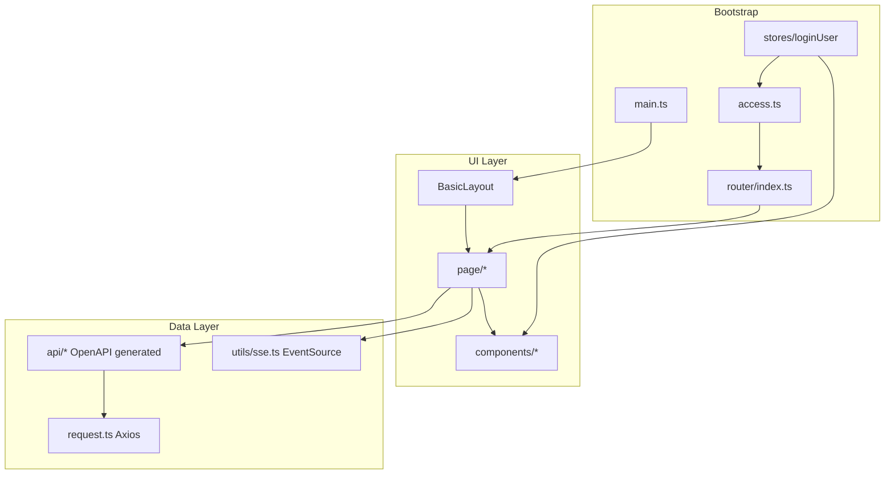

<!-- Generated by SpecStory, Markdown v2.1.0 -->

# 2026-09-02 09:21:21Z

<!-- Cursor IDE Session f4bf81c2-4f78-4325-9c32-ea1440e16065 (2026-09-02 09:21:21Z) -->

_**User**_

Explore the Vue frontend of the project at d:\Liyalin\javafail\hive-ai-code-mother\hive-ai-code-mother-frontend (branch `main`).

Do NOT read node_modules or .specstory directories.

I need a thorough inventory to write a project README. Please report:

1. **package.json**: name, version, all scripts, and all dependencies + devDependencies with versions. Identify the framework versions (Vue, Vite, TypeScript, Ant Design Vue, Pinia, vue-router, axios, etc.) and any notable libs (markdown rendering, highlight.js, etc.)
2. **Directory structure** under src/ — list folders and their purpose.
3. **Pages**: every page component in src/page (or src/pages) with its route path and what the page does.
4. **Router**: full route table from src/router — path, name, component, meta.
5. **Components**: list components in src/components with a one-line purpose each.
6. **API layer**: files in src/api — how they're generated (openapi generator config?), list the controller files.
7. **State management**: Pinia stores and what they hold.
8. **Access control**: src/access.ts or similar — describe the permission logic.
9. **Config**: vite.config.ts (proxy settings, plugins, aliases), any .env files (REDACT secrets), openapi config file, tailwind/eslint/prettier config presence.
10. **Backend base URL / request config**: src/request.ts — base URL, interceptors, error handling.

Return a well-organized, detailed report with file paths. Be thorough — this is for documentation purposes.

---

_**Agent (composer-2.5)**_

<think><details><summary>Thought Process</summary>
Beginning a thorough inventory of the Vue frontend project to compile the requested documentation.

Reading key configuration files and exploring the directory structure in parallel. Skipping node_modules and .specstory directories.
</details></think>

_**Agent (composer-2.5)**_

I'll explore the Vue frontend systematically and gather package, routing, API, and config details for your README inventory.


_**Agent (composer-2.5)**_

<tool-use data-tool-type="unknown" data-tool-name="update_current_step"><details>
<summary>Tool use: **update_current_step**</summary>
An unknown error occurred
</details></tool-use>

_**Agent (composer-2.5)**_

<tool-use data-tool-type="read" data-tool-name="read_file_v2"><details>
<summary>Tool use: **read_file_v2** • Read file: d:\Liyalin\javafail\hive-ai-code-mother\hive-ai-code-mother-frontend\package.json</summary>

</details></tool-use>

_**Agent (composer-2.5)**_

<tool-use data-tool-type="search" data-tool-name="glob_file_search"><details>
<summary>Tool use: **glob_file_search** • Searched codebase "" • **43** results in **1** directory</summary>

Directory: **`d:\Liyalin\javafail\hive-ai-code-mother\hive-ai-code-mother-frontend\src`** (43 files)

| File |
|------|
| `../hive-ai-code-mother-frontend/src/page/app/AppEditPage.vue` |
| `../hive-ai-code-mother-frontend/src/access.ts` |
| `../hive-ai-code-mother-frontend/src/assets/logo.png` |
| `../hive-ai-code-mother-frontend/src/api/healthController.ts` |
| `../hive-ai-code-mother-frontend/src/api/index.ts` |
| `../hive-ai-code-mother-frontend/src/constants/chatMessageType.ts` |
| `../hive-ai-code-mother-frontend/src/request.ts` |
| `../hive-ai-code-mother-frontend/src/config/menu.ts` |
| `../hive-ai-code-mother-frontend/src/api/userController.ts` |
| `../hive-ai-code-mother-frontend/src/api/typings.d.ts` |
| `../hive-ai-code-mother-frontend/src/stores/loginUser.ts` |
| `../hive-ai-code-mother-frontend/src/App.vue` |
| `../hive-ai-code-mother-frontend/src/utils/CodeGenType.ts` |
| `../hive-ai-code-mother-frontend/src/page/HomePage.vue` |
| `../hive-ai-code-mother-frontend/src/layouts/BasicLayout.vue` |
| `../hive-ai-code-mother-frontend/src/utils/coverUrl.ts` |
| `../hive-ai-code-mother-frontend/src/page/user/UserLoginPage.vue` |
| `../hive-ai-code-mother-frontend/src/router/index.ts` |
| `../hive-ai-code-mother-frontend/src/components/AppCard.vue` |
| `../hive-ai-code-mother-frontend/src/config/env.ts` |
| `../hive-ai-code-mother-frontend/src/page/admin/UserManagePage.vue` |
| `../hive-ai-code-mother-frontend/src/utils/markdown.ts` |
| `../hive-ai-code-mother-frontend/src/page/user/UserRegisterPage.vue` |
| `../hive-ai-code-mother-frontend/src/api/chatHistoryController.ts` |
| `../hive-ai-code-mother-frontend/src/api/appController.ts` |
| `../hive-ai-code-mother-frontend/src/api/staticResourceController.ts` |
| `../hive-ai-code-mother-frontend/src/composables/useTypewriterDisplay.ts` |
| `../hive-ai-code-mother-frontend/src/components/AppPromptInput.vue` |
| `../hive-ai-code-mother-frontend/src/utils/codeHighlight.ts` |
| `../hive-ai-code-mother-frontend/src/utils/downloadAppCode.ts` |
| `../hive-ai-code-mother-frontend/src/utils/sse.ts` |
| `../hive-ai-code-mother-frontend/src/components/GlobalFooter.vue` |
| `../hive-ai-code-mother-frontend/src/page/admin/AppManagePage.vue` |
| `../hive-ai-code-mother-frontend/src/components/AppCodeViewer.vue` |
| `../hive-ai-code-mother-frontend/src/main.ts` |
| `../hive-ai-code-mother-frontend/src/components/AiMessageContent.vue` |
| `../hive-ai-code-mother-frontend/src/components/GlobalHeader.vue` |
| `../hive-ai-code-mother-frontend/src/utils/appPreview.ts` |
| `../hive-ai-code-mother-frontend/src/page/admin/ChatHistoryManagePage.vue` |
| `../hive-ai-code-mother-frontend/src/assets/tailwind.css` |
| `../hive-ai-code-mother-frontend/src/utils/aiMessage.ts` |
| `../hive-ai-code-mother-frontend/src/page/app/AppChatPage.vue` |
| `../hive-ai-code-mother-frontend/src/utils/visualEdit.ts` |
</details></tool-use>

_**Agent (composer-2.5)**_

<tool-use data-tool-type="search" data-tool-name="glob_file_search"><details>
<summary>Tool use: **glob_file_search** • Searched codebase "" • **108** results in **1** directory</summary>

Directory: **`d:\Liyalin\javafail\hive-ai-code-mother\hive-ai-code-mother-frontend`** (108 files)

| File |
|------|
| `../hive-ai-code-mother-frontend/src/page/HomePage.vue` |
| `../hive-ai-code-mother-frontend/src/page/app/AppEditPage.vue` |
| `../hive-ai-code-mother-frontend/.specstory/history/2026-07-29_08-00-17Z-conversation-page-modifications.md` |
| `../hive-ai-code-mother-frontend/.specstory/history/2026-07-21_14-01-32Z-d-liyalin-javafail-hive.md` |
| `../hive-ai-code-mother-frontend/.specstory/history/2026-07-21_05-33-45Z-hash-hash-1-1.md` |
| `../hive-ai-code-mother-frontend/src/page/admin/ChatHistoryManagePage.vue` |
| `../hive-ai-code-mother-frontend/.specstory/statistics.json` |
| `../hive-ai-code-mother-frontend/.gitignore` |
| `../hive-ai-code-mother-frontend/接口文档.md` |
| `../hive-ai-code-mother-frontend/src/constants/chatMessageType.ts` |
| `../hive-ai-code-mother-frontend/src/utils/sse.ts` |
| `../hive-ai-code-mother-frontend/docs/superpowers/specs/2026-07-21-code-gen-type-design.md` |
| `../hive-ai-code-mother-frontend/src/page/admin/UserManagePage.vue` |
| `../hive-ai-code-mother-frontend/src/components/AppCard.vue` |
| `../hive-ai-code-mother-frontend/src/api/userController.ts` |
| `../hive-ai-code-mother-frontend/package-lock.json` |
| `../hive-ai-code-mother-frontend/src/api/staticResourceController.ts` |
| `../hive-ai-code-mother-frontend/src/request.ts` |
| `../hive-ai-code-mother-frontend/src/utils/downloadAppCode.ts` |
| `../hive-ai-code-mother-frontend/.specstory/cli/config.toml` |
| `../hive-ai-code-mother-frontend/src/api/index.ts` |
| `../hive-ai-code-mother-frontend/src/composables/useTypewriterDisplay.ts` |
| `../hive-ai-code-mother-frontend/tsconfig.json` |
| `../hive-ai-code-mother-frontend/src/config/menu.ts` |
| `../hive-ai-code-mother-frontend/.editorconfig` |
| `../hive-ai-code-mother-frontend/README.md` |
| `../hive-ai-code-mother-frontend/env.d.ts` |
| `../hive-ai-code-mother-frontend/.specstory/history/2026-07-21_13-58-50Z-task-1-d-liyalin.md` |
| `../hive-ai-code-mother-frontend/src/layouts/BasicLayout.vue` |
| `../hive-ai-code-mother-frontend/src/api/healthController.ts` |
| `../hive-ai-code-mother-frontend/src/api/appController.ts` |
| `../hive-ai-code-mother-frontend/.specstory/history/2026-07-21_13-51-47Z-d-liyalin-javafail-hive.md` |
| `../hive-ai-code-mother-frontend/src/utils/appPreview.ts` |
| `../hive-ai-code-mother-frontend/tsconfig.app.json` |
| `../hive-ai-code-mother-frontend/.specstory/history/2026-07-21_12-33-40Z-task-2-commit-d.md` |
| `../hive-ai-code-mother-frontend/.specstory/history/2026-07-21_07-00-40Z-vue-head-d-liyalin.md` |
| `../hive-ai-code-mother-frontend/src/utils/visualEdit.ts` |
| `../hive-ai-code-mother-frontend/background.png` |
| `../hive-ai-code-mother-frontend/.specstory/history/2026-07-21_06-26-20Z-review-task-3-routes.md` |
| `../hive-ai-code-mother-frontend/.gitattributes` |
| `../hive-ai-code-mother-frontend/src/utils/coverUrl.ts` |
| `../hive-ai-code-mother-frontend/src/App.vue` |
| `../hive-ai-code-mother-frontend/.specstory/history/2026-07-21_13-24-11Z-应用详情按钮.md` |
| `../hive-ai-code-mother-frontend/.specstory/history/2026-07-21_06-28-59Z-implement-task-4-apppromptinput.md` |
| `../hive-ai-code-mother-frontend/.specstory/history/2026-07-21_13-50-22Z-d-liyalin-javafail-hive.md` |
| `../hive-ai-code-mother-frontend/vite.config.ts` |
| `../hive-ai-code-mother-frontend/.specstory/history/2026-07-21_12-39-22Z-d-liyalin-javafail-hive.md` |
| `../hive-ai-code-mother-frontend/src/assets/tailwind.css` |
| `../hive-ai-code-mother-frontend/index.html` |
| `../hive-ai-code-mother-frontend/docs/superpowers/specs/2026-07-21-app-pages-design.md` |
| `../hive-ai-code-mother-frontend/openapi2ts.config.ts` |
| `../hive-ai-code-mother-frontend/docs/superpowers/plans/2026-07-21-app-detail-modal.md` |
| `../hive-ai-code-mother-frontend/public/favicon.ico` |
| `../hive-ai-code-mother-frontend/src/page/admin/AppManagePage.vue` |
| `../hive-ai-code-mother-frontend/src/utils/CodeGenType.ts` |
| `../hive-ai-code-mother-frontend/.specstory/history/2026-07-21_06-24-15Z-implement-task-3-routes.md` |
| `../hive-ai-code-mother-frontend/src/assets/logo.png` |
| `../hive-ai-code-mother-frontend/src/config/env.ts` |
| `../hive-ai-code-mother-frontend/.specstory/history/2026-07-21_13-25-11Z-code-generation-type-management.md` |
| `../hive-ai-code-mother-frontend/.specstory/history/2026-07-21_05-33-45Z-应用代码生成.md` |
| `../hive-ai-code-mother-frontend/src/utils/codeHighlight.ts` |
| `../hive-ai-code-mother-frontend/src/components/AppCodeViewer.vue` |
| `../hive-ai-code-mother-frontend/.specstory/history/2026-07-21_13-17-55Z-task-1-commit-d.md` |
| `../hive-ai-code-mother-frontend/.prettierrc.json` |
| `../hive-ai-code-mother-frontend/.specstory/history/2026-07-21_06-13-29Z-implement-task-1-deploy.md` |
| `../hive-ai-code-mother-frontend/grafana/ai_model_grafana_config.json` |
| `../hive-ai-code-mother-frontend/scripts/ai-message-parse-check.mjs` |
| `../hive-ai-code-mother-frontend/.specstory/history/2026-07-21_06-20-06Z-implement-task-2-sse.md` |
| `../hive-ai-code-mother-frontend/.specstory/history/2026-07-21_07-04-38Z-app-specstory-api-store.md` |
| `../hive-ai-code-mother-frontend/.specstory/history/2026-07-21_13-23-00Z-d-liyalin-javafail-hive.md` |
| `../hive-ai-code-mother-frontend/.specstory/history/2026-07-08_13-41-34Z-brainstorming-session.md` |
| `../hive-ai-code-mother-frontend/.specstory/history/2026-07-21_13-31-00Z-d-liyalin-javafail-hive.md` |
| `../hive-ai-code-mother-frontend/src/router/index.ts` |
| `../hive-ai-code-mother-frontend/docs/superpowers/plans/2026-07-21-chat-code-preview.md` |
| `../hive-ai-code-mother-frontend/.specstory/history/2026-07-21_13-23-57Z-task-2-commit-d.md` |
| `../hive-ai-code-mother-frontend/docs/superpowers/plans/2026-07-21-code-gen-type.md` |
| `../hive-ai-code-mother-frontend/src/page/user/UserLoginPage.vue` |
| `../hive-ai-code-mother-frontend/tsconfig.node.json` |
| `../hive-ai-code-mother-frontend/src/main.ts` |
| `../hive-ai-code-mother-frontend/docs/superpowers/specs/2026-07-21-app-card-actions-design.md` |
| `../hive-ai-code-mother-frontend/.specstory/history/2026-07-21_13-40-36Z-task-1-vue-3.md` |
| `../hive-ai-code-mother-frontend/src/api/typings.d.ts` |
| `../hive-ai-code-mother-frontend/src/components/GlobalFooter.vue` |
| `../hive-ai-code-mother-frontend/src/page/user/UserRegisterPage.vue` |
| `../hive-ai-code-mother-frontend/.specstory/history/2026-07-21_06-17-42Z-review-task-1-deploy.md` |
| `../hive-ai-code-mother-frontend/src/components/GlobalHeader.vue` |
| `../hive-ai-code-mother-frontend/docs/superpowers/plans/2026-07-21-app-card-actions.md` |
| `../hive-ai-code-mother-frontend/src/components/AppPromptInput.vue` |
| `../hive-ai-code-mother-frontend/.specstory/history/2026-07-21_12-30-30Z-task-1-commit-d.md` |
| `../hive-ai-code-mother-frontend/docs/superpowers/plans/2026-07-21-app-pages.md` |
| `../hive-ai-code-mother-frontend/src/page/app/AppChatPage.vue` |
| `../hive-ai-code-mother-frontend/large-id-regression.mjs` |
| `../hive-ai-code-mother-frontend/package.json` |
| `../hive-ai-code-mother-frontend/eslint.config.ts` |
| `../hive-ai-code-mother-frontend/.specstory/.project.json` |
| `../hive-ai-code-mother-frontend/src/access.ts` |
| `../hive-ai-code-mother-frontend/src/api/chatHistoryController.ts` |
| `../hive-ai-code-mother-frontend/docs/superpowers/specs/2026-07-21-app-detail-modal-design.md` |
| `../hive-ai-code-mother-frontend/.specstory/history/2026-07-21_06-22-29Z-review-task-2-sse.md` |
| `../hive-ai-code-mother-frontend/docs/superpowers/specs/2026-07-21-chat-code-preview-design.md` |
| `../hive-ai-code-mother-frontend/src/components/AiMessageContent.vue` |
| `../hive-ai-code-mother-frontend/src/utils/markdown.ts` |
| `../hive-ai-code-mother-frontend/src/utils/aiMessage.ts` |
| `../hive-ai-code-mother-frontend/.specstory/history/2026-07-21_13-24-11Z-c2818079-bc8d-4136-aa58-f9a304c83a85.md` |
| `../hive-ai-code-mother-frontend/.env.development` |
| `../hive-ai-code-mother-frontend/src/stores/loginUser.ts` |
| `../hive-ai-code-mother-frontend/.specstory/history/2026-07-21_12-32-49Z-d-liyalin-javafail-hive.md` |
| `../hive-ai-code-mother-frontend/.cursorindexingignore` |
</details></tool-use>

_**Agent (composer-2.5)**_

<tool-use data-tool-type="unknown" data-tool-name="ripgrep_raw_search"><details>
<summary>Tool use: **ripgrep_raw_search**</summary>

Parameters:

```json
{
  "caseInsensitive": false,
  "outputMode": "files_with_matches",
  "path": "d:\\Liyalin\\javafail\\hive-ai-code-mother\\hive-ai-code-mother-frontend\\src\\router",
  "pattern": "."
}
```
Additional data:

```json
{
  "isPruned": true,
  "outputMode": "files_with_matches",
  "path": "d:\\Liyalin\\javafail\\hive-ai-code-mother\\hive-ai-code-mother-frontend\\src\\router",
  "pattern": ".",
  "topFiles": [
    {
      "matchCount": 1,
      "uri": "hive-ai-code-mother-frontend\\src\\router\\index.ts"
    }
  ],
  "totalFiles": 1,
  "totalMatches": 1
}
```
Status: **completed**

</details></tool-use>

_**Agent (composer-2.5)**_

<think><details><summary>Thought Process</summary>
Progress is good. I am now reading key files in parallel: router, access.ts, request.ts, vite.config.ts, openapi2ts.config.ts, stores, pages, components, env files, and configuration files.
</details></think>

_**Agent (composer-2.5)**_

<tool-use data-tool-type="read" data-tool-name="read_file_v2"><details>
<summary>Tool use: **read_file_v2** • Read file: d:\Liyalin\javafail\hive-ai-code-mother\hive-ai-code-mother-frontend\src\router\index.ts</summary>

</details></tool-use>

_**Agent (composer-2.5)**_

<tool-use data-tool-type="read" data-tool-name="read_file_v2"><details>
<summary>Tool use: **read_file_v2** • Read file: d:\Liyalin\javafail\hive-ai-code-mother\hive-ai-code-mother-frontend\src\access.ts</summary>

</details></tool-use>

_**Agent (composer-2.5)**_

<tool-use data-tool-type="read" data-tool-name="read_file_v2"><details>
<summary>Tool use: **read_file_v2** • Read file: d:\Liyalin\javafail\hive-ai-code-mother\hive-ai-code-mother-frontend\src\request.ts</summary>

</details></tool-use>

_**Agent (composer-2.5)**_

<tool-use data-tool-type="read" data-tool-name="read_file_v2"><details>
<summary>Tool use: **read_file_v2** • Read file: d:\Liyalin\javafail\hive-ai-code-mother\hive-ai-code-mother-frontend\vite.config.ts</summary>

</details></tool-use>

_**Agent (composer-2.5)**_

<tool-use data-tool-type="read" data-tool-name="read_file_v2"><details>
<summary>Tool use: **read_file_v2** • Read file: d:\Liyalin\javafail\hive-ai-code-mother\hive-ai-code-mother-frontend\openapi2ts.config.ts</summary>

</details></tool-use>

_**Agent (composer-2.5)**_

<tool-use data-tool-type="search" data-tool-name="glob_file_search"><details>
<summary>Tool use: **glob_file_search** • Searched codebase "" • **1** result in **1** directory</summary>

Directory: **`d:\Liyalin\javafail\hive-ai-code-mother\hive-ai-code-mother-frontend`** (1 file)

| File |
|------|
| `../hive-ai-code-mother-frontend/.env.development` |
</details></tool-use>

_**Agent (composer-2.5)**_

<tool-use data-tool-type="search" data-tool-name="glob_file_search"><details>
<summary>Tool use: **glob_file_search** • Searched codebase "" • **1** result in **1** directory</summary>

Directory: **`d:\Liyalin\javafail\hive-ai-code-mother\hive-ai-code-mother-frontend`** (1 file)

| File |
|------|
| `../hive-ai-code-mother-frontend/eslint.config.ts` |
</details></tool-use>

_**Agent (composer-2.5)**_

<tool-use data-tool-type="read" data-tool-name="read_file_v2"><details>
<summary>Tool use: **read_file_v2** • Read file: d:\Liyalin\javafail\hive-ai-code-mother\hive-ai-code-mother-frontend\src\stores\loginUser.ts</summary>

</details></tool-use>

_**Agent (composer-2.5)**_

<tool-use data-tool-type="read" data-tool-name="read_file_v2"><details>
<summary>Tool use: **read_file_v2** • Read file: d:\Liyalin\javafail\hive-ai-code-mother\hive-ai-code-mother-frontend\src\config\env.ts</summary>

</details></tool-use>

_**Agent (composer-2.5)**_

<tool-use data-tool-type="read" data-tool-name="read_file_v2"><details>
<summary>Tool use: **read_file_v2** • Read file: d:\Liyalin\javafail\hive-ai-code-mother\hive-ai-code-mother-frontend\src\api\index.ts</summary>

</details></tool-use>

_**Agent (composer-2.5)**_

<think><details><summary>Thought Process</summary>
Reading all page components to understand their functionality.

Expanding the inventory to include environment files, linting and formatting configs, layout components, menu configuration, API controllers, and build settings.
</details></think>

_**Agent (composer-2.5)**_

<tool-use data-tool-type="read" data-tool-name="read_file_v2"><details>
<summary>Tool use: **read_file_v2** • Read file: d:\Liyalin\javafail\hive-ai-code-mother\hive-ai-code-mother-frontend\.env.development</summary>

</details></tool-use>

_**Agent (composer-2.5)**_

<tool-use data-tool-type="read" data-tool-name="read_file_v2"><details>
<summary>Tool use: **read_file_v2** • Read file: d:\Liyalin\javafail\hive-ai-code-mother\hive-ai-code-mother-frontend\eslint.config.ts</summary>

</details></tool-use>

_**Agent (composer-2.5)**_

<tool-use data-tool-type="read" data-tool-name="read_file_v2"><details>
<summary>Tool use: **read_file_v2** • Read file: d:\Liyalin\javafail\hive-ai-code-mother\hive-ai-code-mother-frontend\.prettierrc.json</summary>

</details></tool-use>

_**Agent (composer-2.5)**_

<tool-use data-tool-type="read" data-tool-name="read_file_v2"><details>
<summary>Tool use: **read_file_v2** • Read file: d:\Liyalin\javafail\hive-ai-code-mother\hive-ai-code-mother-frontend\src\main.ts</summary>

</details></tool-use>

_**Agent (composer-2.5)**_

<tool-use data-tool-type="read" data-tool-name="read_file_v2"><details>
<summary>Tool use: **read_file_v2** • Read file: d:\Liyalin\javafail\hive-ai-code-mother\hive-ai-code-mother-frontend\src\App.vue</summary>

</details></tool-use>

_**Agent (composer-2.5)**_

<tool-use data-tool-type="read" data-tool-name="read_file_v2"><details>
<summary>Tool use: **read_file_v2** • Read file: d:\Liyalin\javafail\hive-ai-code-mother\hive-ai-code-mother-frontend\src\config\menu.ts</summary>

</details></tool-use>

_**Agent (composer-2.5)**_

<tool-use data-tool-type="read" data-tool-name="read_file_v2"><details>
<summary>Tool use: **read_file_v2** • Read file: d:\Liyalin\javafail\hive-ai-code-mother\hive-ai-code-mother-frontend\src\layouts\BasicLayout.vue</summary>

</details></tool-use>

_**Agent (composer-2.5)**_

<tool-use data-tool-type="read" data-tool-name="read_file_v2"><details>
<summary>Tool use: **read_file_v2** • Read file: d:\Liyalin\javafail\hive-ai-code-mother\hive-ai-code-mother-frontend\src\page\HomePage.vue</summary>

</details></tool-use>

_**Agent (composer-2.5)**_

<tool-use data-tool-type="read" data-tool-name="read_file_v2"><details>
<summary>Tool use: **read_file_v2** • Read file: d:\Liyalin\javafail\hive-ai-code-mother\hive-ai-code-mother-frontend\src\page\user\UserLoginPage.vue</summary>

</details></tool-use>

_**Agent (composer-2.5)**_

<tool-use data-tool-type="read" data-tool-name="read_file_v2"><details>
<summary>Tool use: **read_file_v2** • Read file: d:\Liyalin\javafail\hive-ai-code-mother\hive-ai-code-mother-frontend\src\page\user\UserRegisterPage.vue</summary>

</details></tool-use>

_**Agent (composer-2.5)**_

<think><details><summary>Thought Process</summary>
Now examining admin pages, app pages, components, and API controller headers.
</details></think>

_**Agent (composer-2.5)**_

<tool-use data-tool-type="read" data-tool-name="read_file_v2"><details>
<summary>Tool use: **read_file_v2** • Read file: d:\Liyalin\javafail\hive-ai-code-mother\hive-ai-code-mother-frontend\src\page\admin\UserManagePage.vue</summary>

</details></tool-use>

_**Agent (composer-2.5)**_

<tool-use data-tool-type="read" data-tool-name="read_file_v2"><details>
<summary>Tool use: **read_file_v2** • Read file: d:\Liyalin\javafail\hive-ai-code-mother\hive-ai-code-mother-frontend\src\page\admin\AppManagePage.vue</summary>

</details></tool-use>

_**Agent (composer-2.5)**_

<tool-use data-tool-type="read" data-tool-name="read_file_v2"><details>
<summary>Tool use: **read_file_v2** • Read file: d:\Liyalin\javafail\hive-ai-code-mother\hive-ai-code-mother-frontend\src\page\admin\ChatHistoryManagePage.vue</summary>

</details></tool-use>

_**Agent (composer-2.5)**_

<tool-use data-tool-type="read" data-tool-name="read_file_v2"><details>
<summary>Tool use: **read_file_v2** • Read file: d:\Liyalin\javafail\hive-ai-code-mother\hive-ai-code-mother-frontend\src\page\app\AppChatPage.vue</summary>

</details></tool-use>

_**Agent (composer-2.5)**_

<tool-use data-tool-type="read" data-tool-name="read_file_v2"><details>
<summary>Tool use: **read_file_v2** • Read file: d:\Liyalin\javafail\hive-ai-code-mother\hive-ai-code-mother-frontend\src\page\app\AppEditPage.vue</summary>

</details></tool-use>

_**Agent (composer-2.5)**_

<tool-use data-tool-type="read" data-tool-name="read_file_v2"><details>
<summary>Tool use: **read_file_v2** • Read file: d:\Liyalin\javafail\hive-ai-code-mother\hive-ai-code-mother-frontend\src\components\AppCard.vue</summary>

</details></tool-use>

_**Agent (composer-2.5)**_

<tool-use data-tool-type="read" data-tool-name="read_file_v2"><details>
<summary>Tool use: **read_file_v2** • Read file: d:\Liyalin\javafail\hive-ai-code-mother\hive-ai-code-mother-frontend\src\components\AppPromptInput.vue</summary>

</details></tool-use>

_**Agent (composer-2.5)**_

<tool-use data-tool-type="read" data-tool-name="read_file_v2"><details>
<summary>Tool use: **read_file_v2** • Read file: d:\Liyalin\javafail\hive-ai-code-mother\hive-ai-code-mother-frontend\src\components\AppCodeViewer.vue</summary>

</details></tool-use>

_**Agent (composer-2.5)**_

<tool-use data-tool-type="read" data-tool-name="read_file_v2"><details>
<summary>Tool use: **read_file_v2** • Read file: d:\Liyalin\javafail\hive-ai-code-mother\hive-ai-code-mother-frontend\src\components\AiMessageContent.vue</summary>

</details></tool-use>

_**Agent (composer-2.5)**_

<tool-use data-tool-type="read" data-tool-name="read_file_v2"><details>
<summary>Tool use: **read_file_v2** • Read file: d:\Liyalin\javafail\hive-ai-code-mother\hive-ai-code-mother-frontend\src\components\GlobalHeader.vue</summary>

</details></tool-use>

_**Agent (composer-2.5)**_

<tool-use data-tool-type="read" data-tool-name="read_file_v2"><details>
<summary>Tool use: **read_file_v2** • Read file: d:\Liyalin\javafail\hive-ai-code-mother\hive-ai-code-mother-frontend\src\components\GlobalFooter.vue</summary>

</details></tool-use>

_**Agent (composer-2.5)**_

<think><details><summary>Thought Process</summary>
I will now examine the API controller files to understand their generation and list the exported functions.

Checking tailwind CSS imports and tsconfig. Investigating whether dayjs is a direct dependency or transitive from ant-design-vue. Grepping API file headers for exported functions.
</details></think>

_**Agent (composer-2.5)**_

<tool-use data-tool-type="unknown" data-tool-name="ripgrep_raw_search"><details>
<summary>Tool use: **ripgrep_raw_search**</summary>

Parameters:

```json
{
  "caseInsensitive": false,
  "path": "d:\\Liyalin\\javafail\\hive-ai-code-mother\\hive-ai-code-mother-frontend\\src\\api",
  "pattern": "^export (async )?function"
}
```
Additional data:

```json
{
  "isPruned": true,
  "outputMode": "content",
  "path": "d:\\Liyalin\\javafail\\hive-ai-code-mother\\hive-ai-code-mother-frontend\\src\\api",
  "pattern": "^export (async )?function",
  "topFiles": [
    {
      "matchCount": 1,
      "uri": "hive-ai-code-mother-frontend/src/api/healthController.ts"
    },
    {
      "matchCount": 13,
      "uri": "hive-ai-code-mother-frontend/src/api/appController.ts"
    },
    {
      "matchCount": 2,
      "uri": "hive-ai-code-mother-frontend/src/api/chatHistoryController.ts"
    },
    {
      "matchCount": 1,
      "uri": "hive-ai-code-mother-frontend/src/api/staticResourceController.ts"
    },
    {
      "matchCount": 16,
      "uri": "hive-ai-code-mother-frontend/src/api/userController.ts"
    }
  ],
  "totalFiles": 5,
  "totalMatches": 33
}
```
Status: **completed**

</details></tool-use>

_**Agent (composer-2.5)**_

<tool-use data-tool-type="read" data-tool-name="read_file_v2"><details>
<summary>Tool use: **read_file_v2** • Read file: d:\Liyalin\javafail\hive-ai-code-mother\hive-ai-code-mother-frontend\src\api\userController.ts</summary>

</details></tool-use>

_**Agent (composer-2.5)**_

<tool-use data-tool-type="read" data-tool-name="read_file_v2"><details>
<summary>Tool use: **read_file_v2** • Read file: d:\Liyalin\javafail\hive-ai-code-mother\hive-ai-code-mother-frontend\src\api\appController.ts</summary>

</details></tool-use>

_**Agent (composer-2.5)**_

<tool-use data-tool-type="read" data-tool-name="read_file_v2"><details>
<summary>Tool use: **read_file_v2** • Read file: d:\Liyalin\javafail\hive-ai-code-mother\hive-ai-code-mother-frontend\src\api\chatHistoryController.ts</summary>

</details></tool-use>

_**Agent (composer-2.5)**_

<tool-use data-tool-type="read" data-tool-name="read_file_v2"><details>
<summary>Tool use: **read_file_v2** • Read file: d:\Liyalin\javafail\hive-ai-code-mother\hive-ai-code-mother-frontend\src\api\staticResourceController.ts</summary>

</details></tool-use>

_**Agent (composer-2.5)**_

<tool-use data-tool-type="read" data-tool-name="read_file_v2"><details>
<summary>Tool use: **read_file_v2** • Read file: d:\Liyalin\javafail\hive-ai-code-mother\hive-ai-code-mother-frontend\src\api\healthController.ts</summary>

</details></tool-use>

_**Agent (composer-2.5)**_

<tool-use data-tool-type="read" data-tool-name="read_file_v2"><details>
<summary>Tool use: **read_file_v2** • Read file: d:\Liyalin\javafail\hive-ai-code-mother\hive-ai-code-mother-frontend\src\assets\tailwind.css</summary>

</details></tool-use>

_**Agent (composer-2.5)**_

<tool-use data-tool-type="search" data-tool-name="glob_file_search"><details>
<summary>Tool use: **glob_file_search** • Searched codebase "" • **1** result in **1** directory</summary>

Directory: **`d:\Liyalin\javafail\hive-ai-code-mother\hive-ai-code-mother-frontend`** (1 file)

| File |
|------|
| `../hive-ai-code-mother-frontend/src/assets/tailwind.css` |
</details></tool-use>

_**Agent (composer-2.5)**_

<tool-use data-tool-type="search" data-tool-name="glob_file_search"><details>
<summary>Tool use: **glob_file_search** • Searched codebase "" • **1** result in **1** directory</summary>

Directory: **`d:\Liyalin\javafail\hive-ai-code-mother\hive-ai-code-mother-frontend\src`** (1 file)

| File |
|------|
| `../hive-ai-code-mother-frontend/src/stores/loginUser.ts` |
</details></tool-use>

_**Agent (composer-2.5)**_

<tool-use data-tool-type="read" data-tool-name="read_file_v2"><details>
<summary>Tool use: **read_file_v2** • Read file: d:\Liyalin\javafail\hive-ai-code-mother\hive-ai-code-mother-frontend\tsconfig.json</summary>

</details></tool-use>

_**Agent (composer-2.5)**_

<tool-use data-tool-type="read" data-tool-name="read_file_v2"><details>
<summary>Tool use: **read_file_v2** • Read file: d:\Liyalin\javafail\hive-ai-code-mother\hive-ai-code-mother-frontend\.editorconfig</summary>

</details></tool-use>

_**Agent (composer-2.5)**_

<think><details><summary>Thought Process</summary>
Checking AppChatPage functionality, utils folder purposes, and key configuration files. A potential mismatch was spotted between env.ts using VITE_BACKEND_ORIGIN and .env using VITE_API_BASE_URL; the latter may be unused.

Checking the README for additional project context.
</details></think>

_**Agent (composer-2.5)**_

<tool-use data-tool-type="read" data-tool-name="read_file_v2"><details>
<summary>Tool use: **read_file_v2** • Read file: d:\Liyalin\javafail\hive-ai-code-mother\hive-ai-code-mother-frontend\env.d.ts</summary>

</details></tool-use>

_**Agent (composer-2.5)**_

<tool-use data-tool-type="read" data-tool-name="read_file_v2"><details>
<summary>Tool use: **read_file_v2** • Read file: d:\Liyalin\javafail\hive-ai-code-mother\hive-ai-code-mother-frontend\tsconfig.app.json</summary>

</details></tool-use>

_**Agent (composer-2.5)**_

<tool-use data-tool-type="read" data-tool-name="read_file_v2"><details>
<summary>Tool use: **read_file_v2** • Read file: d:\Liyalin\javafail\hive-ai-code-mother\hive-ai-code-mother-frontend\index.html</summary>

</details></tool-use>

_**Agent (composer-2.5)**_

<tool-use data-tool-type="read" data-tool-name="read_file_v2"><details>
<summary>Tool use: **read_file_v2** • Read file: d:\Liyalin\javafail\hive-ai-code-mother\hive-ai-code-mother-frontend\src\api\typings.d.ts</summary>

</details></tool-use>

_**Agent (composer-2.5)**_

<tool-use data-tool-type="unknown" data-tool-name="ripgrep_raw_search"><details>
<summary>Tool use: **ripgrep_raw_search**</summary>

Parameters:

```json
{
  "caseInsensitive": false,
  "path": "d:\\Liyalin\\javafail\\hive-ai-code-mother\\hive-ai-code-mother-frontend\\src\\page\\app\\AppChatPage.vue",
  "pattern": "^(const |function |// )"
}
```
Additional data:

```json
{
  "isPruned": true,
  "outputMode": "content",
  "path": "d:\\Liyalin\\javafail\\hive-ai-code-mother\\hive-ai-code-mother-frontend\\src\\page\\app\\AppChatPage.vue",
  "pattern": "^(const |function |// )",
  "topFiles": [
    {
      "matchCount": 40,
      "uri": "hive-ai-code-mother-frontend\\src\\page\\app\\AppChatPage.vue"
    }
  ],
  "totalFiles": 1,
  "totalMatches": 60
}
```
Status: **completed**

</details></tool-use>

_**Agent (composer-2.5)**_

<tool-use data-tool-type="read" data-tool-name="read_file_v2"><details>
<summary>Tool use: **read_file_v2** • Read file: d:\Liyalin\javafail\hive-ai-code-mother\hive-ai-code-mother-frontend\src\utils\sse.ts</summary>

</details></tool-use>

_**Agent (composer-2.5)**_

<tool-use data-tool-type="read" data-tool-name="read_file_v2"><details>
<summary>Tool use: **read_file_v2** • Read file: d:\Liyalin\javafail\hive-ai-code-mother\hive-ai-code-mother-frontend\src\utils\markdown.ts</summary>

</details></tool-use>

_**Agent (composer-2.5)**_

<tool-use data-tool-type="read" data-tool-name="read_file_v2"><details>
<summary>Tool use: **read_file_v2** • Read file: d:\Liyalin\javafail\hive-ai-code-mother\hive-ai-code-mother-frontend\src\utils\codeHighlight.ts</summary>

</details></tool-use>

_**Agent (composer-2.5)**_

<tool-use data-tool-type="read" data-tool-name="read_file_v2"><details>
<summary>Tool use: **read_file_v2** • Read file: d:\Liyalin\javafail\hive-ai-code-mother\hive-ai-code-mother-frontend\src\composables\useTypewriterDisplay.ts</summary>

</details></tool-use>

_**Agent (composer-2.5)**_

<tool-use data-tool-type="read" data-tool-name="read_file_v2"><details>
<summary>Tool use: **read_file_v2** • Read file: d:\Liyalin\javafail\hive-ai-code-mother\hive-ai-code-mother-frontend\src\constants\chatMessageType.ts</summary>

</details></tool-use>

_**Agent (composer-2.5)**_

<think><details><summary>Thought Process</summary>
Reading AppChatPage to understand its full features, including deploy, download, and visual editing.

Noted that `@tailwindcss/vite` is listed in `package.json` but appears missing from `vite.config.ts`, so Tailwind v4 may rely solely on CSS `@import`. Next steps include reading the remaining `HomePage` content, `AppEditPage` templates, user login and register scripts, and checking `.env.production` for `@import` usage.
</details></think>

_**Agent (composer-2.5)**_

<tool-use data-tool-type="unknown" data-tool-name="ripgrep_raw_search"><details>
<summary>Tool use: **ripgrep_raw_search**</summary>

Parameters:

```json
{
  "caseInsensitive": false,
  "glob": "*.{ts,vue,env*}",
  "path": "d:\\Liyalin\\javafail\\hive-ai-code-mother\\hive-ai-code-mother-frontend",
  "pattern": "VITE_"
}
```
Additional data:

```json
{
  "isPruned": true,
  "outputMode": "content",
  "path": "d:\\Liyalin\\javafail\\hive-ai-code-mother\\hive-ai-code-mother-frontend",
  "pattern": "VITE_",
  "topFiles": [
    {
      "matchCount": 2,
      "uri": "hive-ai-code-mother-frontend/src/config/env.ts"
    },
    {
      "matchCount": 2,
      "uri": "hive-ai-code-mother-frontend/.env.development"
    }
  ],
  "totalFiles": 2,
  "totalMatches": 4
}
```
Status: **completed**

</details></tool-use>

_**Agent (composer-2.5)**_

<tool-use data-tool-type="read" data-tool-name="read_file_v2"><details>
<summary>Tool use: **read_file_v2** • Read file: d:\Liyalin\javafail\hive-ai-code-mother\hive-ai-code-mother-frontend\src\page\HomePage.vue</summary>

</details></tool-use>

_**Agent (composer-2.5)**_

<tool-use data-tool-type="read" data-tool-name="read_file_v2"><details>
<summary>Tool use: **read_file_v2** • Read file: d:\Liyalin\javafail\hive-ai-code-mother\hive-ai-code-mother-frontend\src\page\app\AppEditPage.vue</summary>

</details></tool-use>

_**Agent (composer-2.5)**_

<tool-use data-tool-type="read" data-tool-name="read_file_v2"><details>
<summary>Tool use: **read_file_v2** • Read file: d:\Liyalin\javafail\hive-ai-code-mother\hive-ai-code-mother-frontend\src\page\user\UserLoginPage.vue</summary>

</details></tool-use>

_**Agent (composer-2.5)**_

<tool-use data-tool-type="read" data-tool-name="read_file_v2"><details>
<summary>Tool use: **read_file_v2** • Read file: d:\Liyalin\javafail\hive-ai-code-mother\hive-ai-code-mother-frontend\src\page\user\UserRegisterPage.vue</summary>

</details></tool-use>

_**Agent (composer-2.5)**_

<tool-use data-tool-type="unknown" data-tool-name="ripgrep_raw_search"><details>
<summary>Tool use: **ripgrep_raw_search**</summary>

Parameters:

```json
{
  "caseInsensitive": false,
  "path": "d:\\Liyalin\\javafail\\hive-ai-code-mother\\hive-ai-code-mother-frontend\\src\\page\\app\\AppChatPage.vue",
  "pattern": "(deploy|download|delete|visual|preview|Modal)"
}
```
Additional data:

```json
{
  "isPruned": true,
  "outputMode": "content",
  "path": "d:\\Liyalin\\javafail\\hive-ai-code-mother\\hive-ai-code-mother-frontend\\src\\page\\app\\AppChatPage.vue",
  "pattern": "(deploy|download|delete|visual|preview|Modal)",
  "topFiles": [
    {
      "matchCount": 30,
      "uri": "hive-ai-code-mother-frontend\\src\\page\\app\\AppChatPage.vue"
    }
  ],
  "totalFiles": 1,
  "totalMatches": 75
}
```
Status: **completed**

</details></tool-use>

_**Agent (composer-2.5)**_

<tool-use data-tool-type="read" data-tool-name="read_file_v2"><details>
<summary>Tool use: **read_file_v2** • Read file: d:\Liyalin\javafail\hive-ai-code-mother\hive-ai-code-mother-frontend\README.md</summary>

</details></tool-use>

_**Agent (composer-2.5)**_

<think><details><summary>Thought Process</summary>
`@ant-design/icons-vue` is used in the codebase but missing from `package.json`; it is likely pulled in transitively by `ant-design-vue`.

`dayjs` is used but missing from `package.json`; it is likely pulled in transitively by `ant-design-vue`.

`.env` defines `VITE_DEPLOY_DOMAIN`, yet `nv.ts` expects `VITE_DEPLOY_ORIGIN`, so the deployment domain value is ignored. `VITE_API_BASE_URL` is defined in `.env` but never referenced; `env.ts` instead derives `API_BASE_URL` from `BACKEND_ORIGIN`.

`@tailwindcss/vite` is listed in `dependencies` but omitted from `vite.config.ts` plugins. Tailwind v4 imports are handled via CSS, though the plugin may still be needed.
</details></think>

_**Agent (composer-2.5)**_

<tool-use data-tool-type="unknown" data-tool-name="ripgrep_raw_search"><details>
<summary>Tool use: **ripgrep_raw_search**</summary>

Parameters:

```json
{
  "caseInsensitive": false,
  "glob": "*.ts",
  "path": "d:\\Liyalin\\javafail\\hive-ai-code-mother\\hive-ai-code-mother-frontend\\src\\utils",
  "pattern": "^(\\/\\*\\*|export )"
}
```
Additional data:

```json
{
  "isPruned": true,
  "outputMode": "content",
  "path": "d:\\Liyalin\\javafail\\hive-ai-code-mother\\hive-ai-code-mother-frontend\\src\\utils",
  "pattern": "^(\\/\\*\\*|export )",
  "topFiles": [
    {
      "matchCount": 12,
      "uri": "hive-ai-code-mother-frontend/src/utils/CodeGenType.ts"
    },
    {
      "matchCount": 3,
      "uri": "hive-ai-code-mother-frontend/src/utils/sse.ts"
    },
    {
      "matchCount": 7,
      "uri": "hive-ai-code-mother-frontend/src/utils/appPreview.ts"
    },
    {
      "matchCount": 2,
      "uri": "hive-ai-code-mother-frontend/src/utils/coverUrl.ts"
    },
    {
      "matchCount": 5,
      "uri": "hive-ai-code-mother-frontend/src/utils/aiMessage.ts"
    },
    {
      "matchCount": 11,
      "uri": "hive-ai-code-mother-frontend/src/utils/visualEdit.ts"
    }
  ],
  "totalFiles": 6,
  "totalMatches": 59
}
```
Status: **completed**

</details></tool-use>

_**Agent (composer-2.5)**_

<tool-use data-tool-type="read" data-tool-name="read_file_v2"><details>
<summary>Tool use: **read_file_v2** • Read file: d:\Liyalin\javafail\hive-ai-code-mother\hive-ai-code-mother-frontend\src\components\GlobalHeader.vue</summary>

</details></tool-use>

_**Agent (composer-2.5)**_

<tool-use data-tool-type="shell" data-tool-name="run_terminal_command_v2"><details>
<summary>Tool use: **run_terminal_command_v2**</summary>
Terminal unavailable: this machine cannot enforce the 'workspace_readwrite' sandbox policy this command requires, because no working sandbox backend is available (Windows sandbox helper only provides network proxy, not filesystem isolation). This is not a permission denial. Commands requiring this policy cannot run here unless sandbox support is set up on this machine.
</details></tool-use>

_**Agent (composer-2.5)**_

<think><details><summary>Thought Process</summary>
The shell command failed due to sandbox restrictions. The user specified the `main` branch, so I will proceed directly with the requested file inventory.

Tailwind CSS v4 appears to be missing its Vite plugin in `vite.config.ts`. The project only imports `@import 'tailwindcss'` in CSS files, which may leave the build configuration incomplete.

Transitive dependencies appear missing from `package.json`: `@ant-design/icons-vue` and `dayjs` are used but not declared. I will also inspect the `downloadAppCode` and `visualEdit` composables for completeness.
</details></think>

_**Agent (composer-2.5)**_

<tool-use data-tool-type="read" data-tool-name="read_file_v2"><details>
<summary>Tool use: **read_file_v2** • Read file: d:\Liyalin\javafail\hive-ai-code-mother\hive-ai-code-mother-frontend\src\utils\downloadAppCode.ts</summary>

</details></tool-use>

_**Agent (composer-2.5)**_

<tool-use data-tool-type="unknown" data-tool-name="ripgrep_raw_search"><details>
<summary>Tool use: **ripgrep_raw_search**</summary>

Parameters:

```json
{
  "caseInsensitive": false,
  "path": "d:\\Liyalin\\javafail\\hive-ai-code-mother\\hive-ai-code-mother-frontend\\src\\composables",
  "pattern": "useVisualEdit"
}
```
Additional data:

```json
{
  "isPruned": true,
  "outputMode": "content",
  "path": "d:\\Liyalin\\javafail\\hive-ai-code-mother\\hive-ai-code-mother-frontend\\src\\composables",
  "pattern": "useVisualEdit",
  "topFiles": [],
  "totalFiles": 0,
  "totalMatches": 0
}
```
Status: **completed**

</details></tool-use>

_**Agent (composer-2.5)**_

<tool-use data-tool-type="read" data-tool-name="read_file_v2"><details>
<summary>Tool use: **read_file_v2** • Read file: d:\Liyalin\javafail\hive-ai-code-mother\hive-ai-code-mother-frontend\src\utils\visualEdit.ts</summary>

</details></tool-use>

_**Agent (composer-2.5)**_

<think><details><summary>Thought Process</summary>
The `useVisualEdit` composable is exported directly from `visualEdit.ts`.
</details></think>

_**Agent (composer-2.5)**_

<tool-use data-tool-type="unknown" data-tool-name="ripgrep_raw_search"><details>
<summary>Tool use: **ripgrep_raw_search**</summary>

Parameters:

```json
{
  "caseInsensitive": false,
  "path": "d:\\Liyalin\\javafail\\hive-ai-code-mother\\hive-ai-code-mother-frontend\\src\\utils\\visualEdit.ts",
  "pattern": "export function useVisualEdit"
}
```
Additional data:

```json
{
  "isPruned": true,
  "outputMode": "content",
  "path": "d:\\Liyalin\\javafail\\hive-ai-code-mother\\hive-ai-code-mother-frontend\\src\\utils\\visualEdit.ts",
  "pattern": "export function useVisualEdit",
  "topFiles": [
    {
      "matchCount": 1,
      "uri": "hive-ai-code-mother-frontend\\src\\utils\\visualEdit.ts"
    }
  ],
  "totalFiles": 1,
  "totalMatches": 1
}
```
Status: **completed**

</details></tool-use>

_**Agent (composer-2.5)**_

<tool-use data-tool-type="read" data-tool-name="read_file_v2"><details>
<summary>Tool use: **read_file_v2** • Read file: d:\Liyalin\javafail\hive-ai-code-mother\hive-ai-code-mother-frontend\src\utils\visualEdit.ts</summary>

</details></tool-use>

_**Agent (composer-2.5)**_

<think><details><summary>Thought Process</summary>
I have gathered sufficient information to compile the comprehensive project inventory report.

The root contains Vite and OpenAPI configs, TypeScript and ESLint settings, Prettier and EditorConfig, environment files, and documentation. The src/ directory will be organized by folder. An environment variable mismatch was noted.

.env.development defines VITE_DEPLOY_DOMAIN and VITE_API_BASE_URL, but src/config/env.ts reads VITE_BACKEND_ORIGIN and VITE_DEPLOY_ORIGIN instead. Those variables appear stale or unused.

access.ts redirects to loginam, yet UserLoginPage does not apply a post-login redirect and always routes to `/`.
</details></think>

_**Agent (composer-2.5)**_

<tool-use data-tool-type="unknown" data-tool-name="update_current_step"><details>
<summary>Tool use: **update_current_step**</summary>
An unknown error occurred
</details></tool-use>

_**Agent (composer-2.5)**_

<think><details><summary>Thought Process</summary>
Compiling the detailed project inventory report now.
</details></think>

_**Agent (composer-2.5)**_

# Vue Frontend Inventory — `hive-ai-code-mother-frontend`

**Project path:** `d:\Liyalin\javafail\hive-ai-code-mother\hive-ai-code-mother-frontend`  
**Site title (from `index.html`):** AI 零代码应用生成平台

---

## 1. package.json

**File:** `d:\Liyalin\javafail\hive-ai-code-mother\hive-ai-code-mother-frontend\package.json`

| Field | Value |
|-------|-------|
| **name** | `hive-ai-code-mother-frontend` |
| **version** | `0.0.0` |
| **type** | `module` |
| **private** | `true` |

### Scripts

| Script | Command | Purpose |
|--------|---------|---------|
| `dev` | `vite` | Dev server with HMR |
| `build` | `run-p type-check "build-only {@}" --` | Type-check + production build in parallel |
| `build-only` | `vite build` | Production build only |
| `type-check` | `vue-tsc --build` | Vue/TS type checking |
| `preview` | `vite preview` | Preview production build |
| `openapi2ts` | `openapi2ts` | Regenerate API client from OpenAPI spec |
| `lint` | `eslint . --fix` | ESLint with auto-fix |
| `format` | `prettier --write src/` | Format `src/` with Prettier |

### dependencies

| Package | Version |
|---------|---------|
| `@tailwindcss/vite` | `^4.3.2` |
| `@types/json-bigint` | `^1.0.4` |
| `ant-design-vue` | `^4.2.6` |
| `axios` | `^1.18.1` |
| `highlight.js` | `^11.12.0` |
| `json-bigint` | `^1.0.0` |
| `marked` | `^18.0.10` |
| `pinia` | `^3.0.3` |
| `tailwindcss` | `^4.3.2` |
| `vue` | `^3.5.17` |
| `vue-router` | `^4.5.1` |

### devDependencies

| Package | Version |
|---------|---------|
| `@tsconfig/node22` | `^22.0.2` |
| `@types/node` | `^22.15.32` |
| `@umijs/openapi` | `^1.14.1` |
| `@vitejs/plugin-vue` | `^6.0.0` |
| `@vue/eslint-config-prettier` | `^10.2.0` |
| `@vue/eslint-config-typescript` | `^14.5.1` |
| `@vue/tsconfig` | `^0.7.0` |
| `eslint` | `^9.29.0` |
| `eslint-plugin-vue` | `~10.2.0` |
| `jiti` | `^2.4.2` |
| `npm-run-all2` | `^8.0.4` |
| `prettier` | `3.5.3` |
| `tslib` | `^2.8.1` |
| `typescript` | `~5.8.0` |
| `vite` | `^7.0.0` |
| `vite-plugin-vue-devtools` | `^7.7.7` |
| `vue-tsc` | `^2.2.10` |

### Key framework / library versions

| Technology | Version |
|------------|---------|
| Vue | `^3.5.17` |
| Vite | `^7.0.0` |
| TypeScript | `~5.8.0` |
| Ant Design Vue | `^4.2.6` |
| Pinia | `^3.0.3` |
| vue-router | `^4.5.1` |
| axios | `^1.18.1` |
| Tailwind CSS | `^4.3.2` |
| marked (Markdown) | `^18.0.10` |
| highlight.js (syntax highlighting) | `^11.12.0` |
| json-bigint (BigInt-safe JSON parsing) | `^1.0.0` |

### Notable transitive / implicit deps (used in code, not declared)

- **`@ant-design/icons-vue`** — icons in chat, prompt input, header
- **`dayjs`** — date formatting in admin tables and `AppCard`

---

## 2. `src/` Directory Structure

```
src/
├── api/              # OpenAPI-generated HTTP client + typings
├── assets/           # Static assets (logo.png, tailwind.css entry)
├── components/       # Reusable Vue components
├── composables/      # Vue composables (typewriter display)
├── config/           # App config (env constants, nav menu)
├── constants/        # Shared constants (chat message types)
├── layouts/          # Page shell layout
├── page/             # Route-level page components
│   ├── admin/        # Admin CRUD pages
│   ├── app/          # App chat & edit pages
│   └── user/         # Login & register
├── router/           # vue-router config
├── stores/           # Pinia stores
├── utils/            # Helpers (SSE, markdown, preview, visual edit, etc.)
├── access.ts         # Route guard (imported in main.ts)
├── App.vue           # Root component → BasicLayout
├── main.ts           # App bootstrap
└── request.ts        # Axios instance
```

| Folder | Purpose |
|--------|---------|
| `api/` | Auto-generated REST client functions and `API.*` TypeScript types |
| `assets/` | Images and Tailwind CSS entry (`@import 'tailwindcss'`) |
| `components/` | Shared UI: header/footer, cards, chat/code viewers |
| `composables/` | Reusable Vue logic (`useTypewriterDisplay`) |
| `config/` | Environment-derived URLs/timeouts; navigation menu items |
| `constants/` | Enum-like constants for chat message types |
| `layouts/` | `BasicLayout` — header/content/footer shell with `router-view` |
| `page/` | Full-page route components grouped by domain |
| `router/` | Route definitions |
| `stores/` | Pinia state |
| `utils/` | Domain helpers: SSE streaming, markdown/code highlight, app preview URLs, visual edit, zip download |

---

## 3. Pages

All pages live under `src/page/` (singular, not `pages`).

| File | Route | What it does |
|------|-------|--------------|
| `src/page/HomePage.vue` | `/` | Landing page: prompt input to create a new AI app, suggestion tags, paginated “我的作品” (logged-in user apps) and “精选案例” (featured apps) grids via `AppCard` |
| `src/page/user/UserLoginPage.vue` | `/user/login` | Account/password login form; supports `?account=` prefill; on success fetches login user and redirects to `/` |
| `src/page/user/UserRegisterPage.vue` | `/user/register` | Registration with password confirmation; on success redirects to login with account prefilled |
| `src/page/admin/UserManagePage.vue` | `/admin/userManage` | Admin: search users by account/name, paginated table, delete users |
| `src/page/admin/AppManagePage.vue` | `/admin/appManage` | Admin: search apps by name/code-gen type/user ID; edit, feature (priority), delete apps |
| `src/page/admin/ChatHistoryManagePage.vue` | `/admin/chatHistoryManage` | Admin: search chat history by message/type/app ID/user ID; read-only paginated table |
| `src/page/app/AppChatPage.vue` | `/app/chat/:appId` | Core workspace: AI chat via SSE code generation, live preview iframe, code viewer, deploy, download zip, visual element editing, app detail/delete modals; full-screen (no layout) |
| `src/page/app/AppEditPage.vue` | `/app/edit/:appId` | Edit app metadata (name; admins also edit cover URL and priority); owner or admin access |

---

## 4. Router

**File:** `d:\Liyalin\javafail\hive-ai-code-mother\hive-ai-code-mother-frontend\src\router\index.ts`

| Path | Name | Component | Meta |
|------|------|-----------|------|
| `/` | `home` | `HomePage` | — |
| `/user/login` | `用户登录` | `UserLoginPage` | — |
| `/user/register` | `用户注册` | `UserRegisterPage` | — |
| `/admin/userManage` | `用户管理` | `UserManagePage` | — |
| `/admin/appManage` | `应用管理` | `AppManagePage` | — |
| `/admin/chatHistoryManage` | `对话管理` | `ChatHistoryManagePage` | — |
| `/app/chat/:appId` | `应用对话` | `AppChatPage` | `{ hideLayout: true }` |
| `/app/edit/:appId` | `应用编辑` | `AppEditPage` | — |

- History mode: `createWebHistory(import.meta.env.BASE_URL)`
- No lazy loading — all routes are statically imported
- `hideLayout: true` hides header/footer in `BasicLayout` for full-screen chat

---

## 5. Components

**Directory:** `d:\Liyalin\javafail\hive-ai-code-mother\hive-ai-code-mother-frontend\src\components\`

| Component | Purpose |
|-----------|---------|
| `GlobalHeader.vue` | Top nav: logo, site title, admin-filtered menu, login/register or avatar + logout dropdown |
| `GlobalFooter.vue` | Simple footer with GitHub link |
| `AppCard.vue` | App thumbnail card for home grids; click opens chat, optional deploy link for featured apps |
| `AppPromptInput.vue` | Textarea prompt with upload/optimize placeholders (stubbed) and submit; `home` or `chat` variant |
| `AiMessageContent.vue` | Renders parsed AI messages: markdown, collapsible file blocks, tool-call segments, syntax highlighting |
| `AppCodeViewer.vue` | Fetches and displays generated source files with line numbers and highlight.js; supports HTML/multi-file/Vue project modes |

---

## 6. API Layer

**Directory:** `d:\Liyalin\javafail\hive-ai-code-mother\hive-ai-code-mother-frontend\src\api\`

### Generation

Generated by **`@umijs/openapi`** via the `openapi2ts` CLI.

**Config:** `d:\Liyalin\javafail\hive-ai-code-mother\hive-ai-code-mother-frontend\openapi2ts.config.ts`

```ts
{
  requestLibPath: "import request from '@/request'",
  schemaPath: 'http://localhost:8123/api/v3/api-docs',
  serversPath: './src',
}
```

- Regenerate: `npm run openapi2ts`
- Output lands in `src/api/` (controller `.ts` files) and `src/api/typings.d.ts` (`API` namespace)
- Each controller file has `// @ts-ignore`, `/* eslint-disable */`, and uses the shared Axios instance from `@/request`

### Controller files

| File | Exported functions |
|------|-------------------|
| `userController.ts` | `addUser`, `deleteUser`, `getUserById`, `getLoginUser`, `getUserVoById`, `getInfo`, `list`, `listUserVoByPage`, `userLogin`, `userLogout`, `page`, `userRegister`, `remove`, `save`, `update`, `updateUser` |
| `appController.ts` | `addApp`, `deleteAppByAdmin`, `getAppVoByIdByAdmin`, `listAppVoByPageByAdmin`, `updateAppByAdmin`, `chatToGenCode`, `deleteApp`, `deployApp`, `downloadAppCode`, `getAppVoById`, `listGoodAppVoByPage`, `listMyAppVoByPage`, `updateApp` |
| `chatHistoryController.ts` | `listAllChatHistoryByPageForAdmin`, `listAppChatHistory` |
| `staticResourceController.ts` | `serveStaticResource` |
| `healthController.ts` | `healthCheck` |
| `index.ts` | Re-exports all controllers as default object |
| `typings.d.ts` | All `API.*` request/response types |

**Note:** Live chat streaming uses a custom SSE helper (`src/utils/sse.ts`) pointing at `/app/chat/gen/code`, not the generated `chatToGenCode` REST wrapper.

---

## 7. State Management (Pinia)

**Directory:** `d:\Liyalin\javafail\hive-ai-code-mother\hive-ai-code-mother-frontend\src\stores\`

Only one store:

### `loginUser.ts` — `useLoginUserStore`

| State / Action | Description |
|----------------|-------------|
| `loginUser` | `ref<API.LoginUserVO>`, default `{ userName: '未登录' }` |
| `fetchLoginUser()` | Calls `getLoginUser()` API; updates store on success (`code === 0`) |
| `setLoginUser(newLoginUser)` | Manual update (e.g. after logout resets to `{ userName: '未登录' }`) |

Used by: `App.vue`, `access.ts`, `GlobalHeader`, `HomePage`, `AppChatPage`, `AppEditPage`.

---

## 8. Access Control

**File:** `d:\Liyalin\javafail\hive-ai-code-mother\hive-ai-code-mother-frontend\src\access.ts`

Imported in `main.ts` (side-effect registration).

### Logic

1. **`router.beforeEach` guard**
2. On **first navigation**, awaits `loginUserStore.fetchLoginUser()` so refresh waits for session
3. **Admin routes** (`/admin/*`): requires `loginUser.userRole === 'admin'`
   - Otherwise: Ant Design `message.error('没有权限')` and redirect to `/user/login?redirect=<fullPath>`
4. All other routes pass through (no login required for home, login, register, app chat)

### UI-level filtering

`GlobalHeader.vue` filters admin menu items unless user has `userRole === 'admin'`.

`AppChatPage.vue` uses owner/admin checks for delete, deploy, and admin-specific API calls.

---

## 9. Configuration

### `vite.config.ts`

**File:** `d:\Liyalin\javafail\hive-ai-code-mother\hive-ai-code-mother-frontend\vite.config.ts`

| Setting | Value |
|---------|-------|
| **Plugins** | `@vitejs/plugin-vue`, `vite-plugin-vue-devtools` |
| **Alias** | `@` → `./src` |
| **Dev proxy** | `/api` → `http://localhost:8123` (`changeOrigin: true`, `secure: false`) |

**Note:** `@tailwindcss/vite` is in `package.json` but **not** registered in `vite.config.ts`. Tailwind is loaded via `src/assets/tailwind.css` (`@import 'tailwindcss'`).

### Environment files

**`.env.development`** (`d:\Liyalin\javafail\hive-ai-code-mother\hive-ai-code-mother-frontend\.env.development`):

```
VITE_DEPLOY_DOMAIN=http://localhost
VITE_API_BASE_URL=/api
```

**Mismatch:** `src/config/env.ts` reads `VITE_BACKEND_ORIGIN` and `VITE_DEPLOY_ORIGIN`, not the vars above. Effective defaults when unset:

- `BACKEND_ORIGIN` → `http://localhost:8123`
- `API_BASE_URL` → `http://localhost:8123/api`
- `DEPLOY_ORIGIN` → `http://localhost`

No `.env.production` found.

### `src/config/env.ts` constants

| Export | Default | Purpose |
|--------|---------|---------|
| `BACKEND_ORIGIN` | `http://localhost:8123` | Backend server origin |
| `API_BASE_URL` | `{BACKEND_ORIGIN}/api` | Axios base URL |
| `STATIC_BASE_URL` | `{API_BASE_URL}/static` | Generated static assets |
| `DEPLOY_ORIGIN` | `http://localhost` | Deployed app access prefix |
| `DEFAULT_REQUEST_TIMEOUT` | `60000` ms | Normal API timeout |
| `DEPLOY_REQUEST_TIMEOUT` | `600000` ms (10 min) | Deploy timeout |
| `PREVIEW_POLL_INTERVAL` | `2000` ms | Vue build preview polling |
| `PREVIEW_POLL_TIMEOUT` | `180000` ms (3 min) | Preview poll max wait |

### OpenAPI config

`openapi2ts.config.ts` — see §6.

### Tailwind

- No `tailwind.config.js` — Tailwind v4 CSS-first setup
- Entry: `src/assets/tailwind.css` → imported in `main.ts`

### ESLint

**File:** `eslint.config.ts` — flat config with `@vue/eslint-config-typescript`, `eslint-plugin-vue` (essential), Prettier skip-formatting; lints `**/*.{ts,mts,tsx,vue}`.

### Prettier

**File:** `.prettierrc.json` — `semi: false`, `singleQuote: true`, `printWidth: 100`.

### Other

- `.editorconfig` — 2-space indent, UTF-8, LF, max line 100
- `tsconfig.app.json` — path alias `@/*` → `./src/*`
- `env.d.ts` — Vite client types only

---

## 10. Backend Base URL / Request Config

**File:** `d:\Liyalin\javafail\hive-ai-code-mother\hive-ai-code-mother-frontend\src\request.ts`

### Axios instance

| Setting | Value |
|---------|-------|
| **baseURL** | `API_BASE_URL` from `@/config/env` (default `http://localhost:8123/api`) |
| **timeout** | `DEFAULT_REQUEST_TIMEOUT` (60s) |
| **withCredentials** | `true` (session cookies) |
| **transformResponse** | Parses JSON via `json-bigint` with `storeAsString: true` (safe BigInt handling) |

### Request interceptor

Pass-through (no auth headers added; relies on cookies).

### Response interceptor

- On `data.code === 40100` (not logged in):
  - Skips redirect if request was `user/get/login` or already on `/user/login`
  - Otherwise: `message.warning('请先登录')` and `window.location.href = /user/login?redirect=...`
- HTTP errors: rejected to caller (no global handler)
- Successful responses: returned as-is for callers to check `res.data.code`

### Dev vs prod networking

- **Dev:** Vite proxy forwards `/api` → `http://localhost:8123`; if `API_BASE_URL` is absolute (`http://localhost:8123/api`), requests bypass the proxy
- **SSE:** `src/utils/sse.ts` uses `API_BASE_URL` directly for `EventSource` with `withCredentials: true`

---

## Root-Level Files (outside `src/`)

| Path | Purpose |
|------|---------|
| `index.html` | SPA shell, title “AI 零代码应用生成平台” |
| `background.png` | Home page hero background (referenced from `BasicLayout`) |
| `public/favicon.ico` | Favicon |
| `接口文档.md` | API documentation (Chinese) |
| `scripts/ai-message-parse-check.mjs` | AI message parsing validation script |
| `grafana/ai_model_grafana_config.json` | Grafana dashboard config |
| `docs/superpowers/` | Design specs and plans |
| `README.md` | Default Vue/Vite template README (minimal) |

---

## Architecture Summary (for README)



**Core user flow:** Home prompt → `addApp` → `/app/chat/:appId` → SSE stream generates code → live preview + code view → optional deploy/download/visual edit.

If you want, I can turn this inventory into a draft `README.md` section-by-section next.
