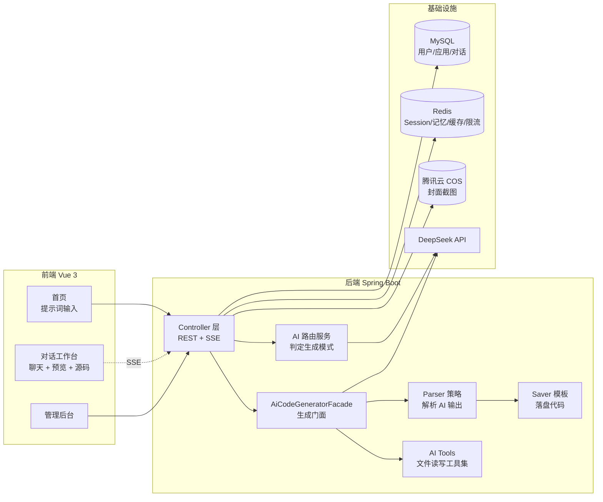

<div align="center">


# Hive AI Code Mother

**AI 零代码应用生成平台 —— 一句话生成、预览并部署完整的前端应用**

[](https://openjdk.org/projects/jdk/21/)
[](https://spring.io/projects/spring-boot)
[](https://vuejs.org/)
[](https://vitejs.dev/)
[](https://docs.langchain4j.dev/)
[](https://www.mysql.com/)
[](https://redis.io/)
[](LICENSE)

</div>

---

## 📖 项目简介

Hive AI Code Mother 是一个基于大语言模型的**零代码应用生成平台**。用户只需用自然语言描述需求，平台会自动判断合适的生成模式、调用 AI 流式生成代码、实时预览效果，并支持一键部署和源码下载。

整个过程像和 AI 对话一样自然：你说「做一个波普风格的电商落地页」，AI 就把代码写出来，右侧同步渲染出网站。

### 核心能力

-  **对话式生成** —— 基于 SSE 的流式输出，AI 边写你边看，支持多轮对话持续迭代
-  **智能模式路由** —— AI 分析初始提示词，自动选择单文件 / 多文件 / Vue 工程三种生成模式
-  **工具调用** —— Vue 工程模式下 AI 可自主读写、修改、删除项目文件，并自动执行 `npm build`
-  **实时预览** —— 生成结果即时渲染，可切换查看源码（带语法高亮）
-  **一键部署** —— 生成独立访问链接，自动 Selenium 截图并上传腾讯云 COS 作为应用封面
-  **源码下载** —— 打包生成的工程为 ZIP
-  **对话历史** —— 游标分页持久化，重进页面无缝恢复上下文
-  **权限体系** —— Session 登录态 + 管理员注解鉴权，用户仅可操作自己的应用
-  **AI 监控** —— Micrometer + Prometheus 采集调用量、Token 消耗、响应耗时，附带 Grafana 面板配置
-  **限流保护** —— 基于 Redisson 的分布式限流（AI 对话默认 5 次/分钟/用户）

---

## 📸 功能预览


## 🧱 技术栈

### 后端

| 分类 | 技术选型 |
| --- | --- |
| 框架 | Spring Boot 3.5.16 · Java 21 |
| AI | LangChain4j 1.1.0 · DeepSeek（`deepseek-chat` / `deepseek-reasoner`） |
| 持久层 | MyBatis-Flex 1.11 · MySQL 8 · HikariCP |
| 缓存 | Redis（Session / 对话记忆 / Spring Cache）· Caffeine（本地实例缓存） |
| 分布式 | Redisson 3.50（限流） |
| 对象存储 | 腾讯云 COS SDK 5.6 |
| 截图 | Selenium 4.33 · WebDriverManager（无头 Chrome） |
| 监控 | Spring Actuator · Micrometer · Prometheus |
| 接口文档 | Knife4j 4.4（OpenAPI 3） |
| 工具库 | Hutool 5.8 · Lombok |

### 前端

| 分类 | 技术选型 |
| --- | --- |
| 框架 | Vue 3.5 · TypeScript 5.8 · Vite 7 |
| UI | Ant Design Vue 4.2 · Tailwind CSS 4 |
| 状态管理 | Pinia 3 |
| 路由 | Vue Router 4 |
| 网络 | Axios · EventSource（SSE）· json-bigint（雪花 ID 精度保护） |
| 渲染 | marked（Markdown）· highlight.js（代码高亮） |
| 接口代码生成 | @umijs/openapi |

---

## 🏗️ 架构设计



## 🚀 快速开始

### 环境要求

| 依赖 | 版本要求 | 说明 |
| --- | --- | --- |
| JDK | 21+ | |
| Maven | 3.8+ | |
| Node.js | 20+ | Vue 工程模式的构建也依赖它 |
| MySQL | 8.0+ | |
| Redis | 5.0+ | 见下方「Redis 版本说明」 |
| Chrome | 最新版 | 部署截图功能需要（Selenium 无头浏览器） |

### 1. 克隆项目

```bash
git clone git@github.com:S-hive/hive-ai-code-mother.git
cd hive-ai-code-mother
```

### 2. 初始化数据库

建表脚本已内置在项目中，直接执行即可：

```bash
mysql -u root -p < sql/create_table.sql
```

脚本会创建 `hive_ai_code_mother` 库，以及 `user`、`app`、`chat_history` 三张表（表结构对应 `model/entity` 下的实体定义）。主键由 MyBatis-Flex 雪花算法生成，因此未使用 `AUTO_INCREMENT`。

### 3. 配置后端

后端配置拆成了三个文件，敏感信息与通用配置分离

克隆项目后，复制示例文件并填入自己的真实配置即可，`application.yml` 无需改动

### 4. 启动后端

```bash
./mvnw spring-boot:run
# Windows
mvnw.cmd spring-boot:run
```

服务启动在 `http://localhost:8123/api`，接口文档见 `http://localhost:8123/api/doc.html`。

### 5. 启动前端

```bash
cd hive-ai-code-mother-frontend
npm install
npm run dev
```

前端默认运行在 `http://localhost:5173`。

---

## ⚙️ 配置说明

### 前端环境变量

在 `hive-ai-code-mother-frontend/` 下创建 `.env.development`：

```bash
VITE_BACKEND_ORIGIN=http://localhost:8123   # 后端地址
VITE_DEPLOY_ORIGIN=http://localhost         # 部署应用的访问域名
```

未配置时会使用 `src/config/env.ts` 中的默认值。

## 🤝 贡献

欢迎提交 Issue 与 Pull Request。

1. Fork 本仓库
2. 创建特性分支：`git checkout -b feature/your-feature`
3. 提交改动：`git commit -m 'feat: 添加某功能'`
4. 推送分支：`git push origin feature/your-feature`
5. 发起 Pull Request

---

## 📄 License

本项目基于 [MIT License](LICENSE) 开源，可自由使用、修改和分发，仅需在副本中保留原始版权声明。

---

<div align="center">

**如果这个项目对你有帮助，欢迎点一个 ⭐ Star**

Made with ❤️ by [S-hive](https://github.com/S-hive)

</div>
