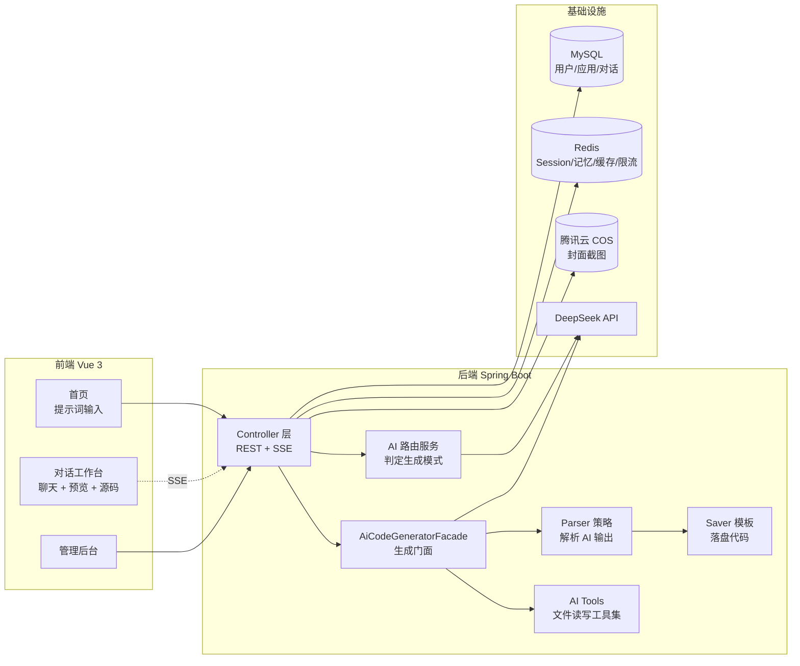

<div align="center">


# 🐝 Hive AI Code Mother

**AI 零代码应用生成平台 —— 一句话生成、预览并部署完整的前端应用**

[](https://openjdk.org/projects/jdk/21/)
[](https://spring.io/projects/spring-boot)
[](https://vuejs.org/)
[](https://vitejs.dev/)
[](https://docs.langchain4j.dev/)
[](https://www.mysql.com/)
[](https://redis.io/)
[](LICENSE)

</div>

---

## 📖 项目简介

Hive AI Code Mother 是一个基于大语言模型的**零代码应用生成平台**。用户只需用自然语言描述需求，平台会自动判断合适的生成模式、调用 AI 流式生成代码、实时预览效果，并支持一键部署和源码下载。

整个过程像和 AI 对话一样自然：你说「做一个波普风格的电商落地页」，AI 就把代码写出来，右侧同步渲染出网站。

### 核心能力

- 🗣️ **对话式生成** —— 基于 SSE 的流式输出，AI 边写你边看，支持多轮对话持续迭代
- 🧠 **智能模式路由** —— AI 分析初始提示词，自动选择单文件 / 多文件 / Vue 工程三种生成模式
- 🛠️ **工具调用** —— Vue 工程模式下 AI 可自主读写、修改、删除项目文件，并自动执行 `npm build`
- 👁️ **实时预览** —— 生成结果即时渲染，可切换查看源码（带语法高亮）
- 🚀 **一键部署** —— 生成独立访问链接，自动 Selenium 截图并上传腾讯云 COS 作为应用封面
- 📦 **源码下载** —— 打包生成的工程为 ZIP
- 💬 **对话历史** —— 游标分页持久化，重进页面无缝恢复上下文
- 🔐 **权限体系** —— Session 登录态 + 管理员注解鉴权，用户仅可操作自己的应用
- 📊 **AI 监控** —— Micrometer + Prometheus 采集调用量、Token 消耗、响应耗时，附带 Grafana 面板配置
- 🚦 **限流保护** —— 基于 Redisson 的分布式限流（AI 对话默认 5 次/分钟/用户）

---

## 📸 功能预览

> **截图待补充。** 把图片按下面的文件名放进 `docs/screenshots/`，然后删掉这段引用说明，并去掉下方 `<!--` 与 `-->` 这一对注释符号即可。

| 文件名 | 建议截取的内容 |
| --- | --- |
| `home.png` | 首页 —— 提示词输入框与精选应用列表 |
| `chat.png` | 对话工作台 —— 左侧 AI 流式对话，右侧实时预览 |
| `source-code.png` | 源码视图 —— 生成结果的文件树与语法高亮 |
| `admin.png` | 管理后台 —— 应用 / 用户 / 对话历史管理 |
| `grafana.png` | Grafana AI 监控面板 |

<!--
<table>
  <tr>
    <td width="50%">
      
      <p align="center"><sub>首页 —— 一句话描述你想要的应用</sub></p>
    </td>
    <td width="50%">
      
      <p align="center"><sub>对话工作台 —— 边生成边预览</sub></p>
    </td>
  </tr>
  <tr>
    <td width="50%">
      
      <p align="center"><sub>源码视图 —— 查看 AI 生成的完整代码</sub></p>
    </td>
    <td width="50%">
      
      <p align="center"><sub>管理后台 —— 应用与用户管理</sub></p>
    </td>
  </tr>
</table>

<div align="center">
  
  <p><sub>Grafana AI 监控面板 —— 调用量、Token 消耗与响应耗时</sub></p>
</div>
-->

---

## 🧱 技术栈

### 后端

| 分类 | 技术选型 |
| --- | --- |
| 框架 | Spring Boot 3.5.16 · Java 21 |
| AI | LangChain4j 1.1.0 · DeepSeek（`deepseek-chat` / `deepseek-reasoner`） |
| 持久层 | MyBatis-Flex 1.11 · MySQL 8 · HikariCP |
| 缓存 | Redis（Session / 对话记忆 / Spring Cache）· Caffeine（本地实例缓存） |
| 分布式 | Redisson 3.50（限流） |
| 对象存储 | 腾讯云 COS SDK 5.6 |
| 截图 | Selenium 4.33 · WebDriverManager（无头 Chrome） |
| 监控 | Spring Actuator · Micrometer · Prometheus |
| 接口文档 | Knife4j 4.4（OpenAPI 3） |
| 工具库 | Hutool 5.8 · Lombok |

### 前端

| 分类 | 技术选型 |
| --- | --- |
| 框架 | Vue 3.5 · TypeScript 5.8 · Vite 7 |
| UI | Ant Design Vue 4.2 · Tailwind CSS 4 |
| 状态管理 | Pinia 3 |
| 路由 | Vue Router 4 |
| 网络 | Axios · EventSource（SSE）· json-bigint（雪花 ID 精度保护） |
| 渲染 | marked（Markdown）· highlight.js（代码高亮） |
| 接口代码生成 | @umijs/openapi |

---

## 🏗️ 架构设计



### 三种代码生成模式

| 模式 | 枚举值 | 产物 | 实现方式 |
| --- | --- | --- | --- |
| 原生 HTML | `html` | 单个 `index.html` | 正则解析 Markdown 代码块 → 模板落盘 |
| 原生多文件 | `multi_file` | `index.html` + `style.css` + `script.js` | 正则解析多个代码块 → 模板落盘 |
| Vue 工程 | `vue_project` | 完整 Vue 项目 + `dist/` 构建产物 | 推理模型 + AI 工具调用逐个写文件，完成后自动 `npm install && npm run build` |

创建应用时由 `AiCodeGenTypeRoutingService` 读取初始提示词自动判定模式，无需用户选择。

### 设计模式落地

项目在代码生成链路上有意识地使用了几个经典模式，便于扩展新的生成类型：

- **策略模式** —— `CodeParser` 接口 + `HtmlCodeParser` / `MultiFileCodeParser`，由 `CodeParserExecutor` 按类型分派
- **模板方法** —— `CodeFileSaverTemplate` 定义落盘骨架，子类只实现差异部分
- **门面模式** —— `AiCodeGeneratorFacade` 统一收口「生成 + 解析 + 保存 + 流式处理」
- **执行器分派** —— `StreamHandlerExecutor` 按生成类型选择 `SimpleTextStreamHandler` 或 `JsonMessageStreamHandler`

### 并发与缓存设计

- **AI 服务实例复用** —— `AiCodeGeneratorServiceFactory` 用 Caffeine 按 `{appId}_{codeGenType}` 缓存实例，上限 1000 个，写入后 30 分钟、访问后 10 分钟过期
- **流式模型多例化** —— 通过 `SpringContextUtil` 取 `streamingChatModelPrototype` / `reasoningStreamingChatModelPrototype`，避免多用户共用同一个 `StreamingChatModel` 实例引发并发问题
- **对话记忆** —— `MessageWindowChatMemory` 仅保留最近 20 条消息，实例创建时由 `loadChatHistoryToMemory` 从数据库回填，重启后上下文不丢
- **工具调用约束** —— `maxSequentialToolsInvocations(20)` 限制连续调用次数防止死循环，`hallucinatedToolNameStrategy` 兜住 AI 幻觉出的工具名
- **精选应用缓存** —— `good_app_page` 缓存 5 分钟，且只缓存前 10 页（`condition = pageNum <= 10`）；其余 Redis 缓存默认 30 分钟过期

---

## 📁 项目结构

```
hive-ai-code-mother/
├── src/main/java/com/hive/hiveaicodemother/
│   ├── ai/                     # AI 服务
│   │   ├── AiCodeGeneratorService.java        # 代码生成 AI 接口
│   │   ├── AiCodeGenTypeRoutingService.java   # 生成模式路由 AI 接口
│   │   ├── tools/              # AI 工具集（文件读写/修改/删除/目录）
│   │   ├── memory/             # Redis 对话记忆存储
│   │   ├── guardrail/          # 输入输出护轨
│   │   └── model/              # AI 结构化输出与流式消息
│   ├── core/                   # 代码生成核心
│   │   ├── AiCodeGeneratorFacade.java
│   │   ├── parser/             # 解析器（策略模式）
│   │   ├── saver/              # 保存器（模板方法）
│   │   ├── handler/            # 流式处理器
│   │   └── builder/            # Vue 工程构建器
│   ├── controller/             # App / User / ChatHistory / StaticResource / Health
│   ├── service/                # 业务服务层
│   ├── model/                  # entity / dto / vo / enums
│   ├── config/                 # Redis / CORS / COS / AI 模型配置
│   ├── ratelimter/             # 限流注解 + 切面 + Redisson
│   ├── monitor/                # AI 调用指标采集
│   ├── manager/                # COS 上传管理
│   ├── aop/ · annotation/      # 权限校验
│   ├── exception/              # 全局异常与错误码
│   └── utils/                  # 截图、缓存键、Spring 上下文工具
├── src/main/resources/
│   ├── prompt/                 # 系统提示词（html/multi/vue/routing）
│   ├── mapper/                 # MyBatis XML
│   ├── application.yml         # 主配置（公开，指向 local 配置）
│   ├── application-local.yml   # ⚠️ 敏感配置，已 gitignore，需自行创建
│   └── application-local.yml.example  # 敏感配置模板（公开）
├── hive-ai-code-mother-frontend/
│   ├── src/
│   │   ├── page/               # 首页 / 对话页 / 编辑页 / 用户页 / 管理页
│   │   ├── components/         # 头尾布局、应用卡片、消息渲染、源码查看
│   │   ├── api/                # OpenAPI 自动生成的请求代码
│   │   ├── stores/ · access.ts # 登录态与路由权限
│   │   ├── utils/              # SSE、Markdown、预览地址等
│   │   └── config/env.ts       # 环境常量
│   └── grafana/                # AI 监控面板配置
└── pom.xml
```

---

## 🚀 快速开始

### 环境要求

| 依赖 | 版本要求 | 说明 |
| --- | --- | --- |
| JDK | 21+ | |
| Maven | 3.8+ | |
| Node.js | 20+ | Vue 工程模式的构建也依赖它 |
| MySQL | 8.0+ | |
| Redis | 5.0+ | 见下方「Redis 版本说明」 |
| Chrome | 最新版 | 部署截图功能需要（Selenium 无头浏览器） |

### 1. 克隆项目

```bash
git clone git@github.com:S-hive/hive-ai-code-mother.git
cd hive-ai-code-mother
```

### 2. 初始化数据库

建表脚本已内置在项目中，直接执行即可：

```bash
mysql -u root -p < sql/create_table.sql
```

脚本会创建 `hive_ai_code_mother` 库，以及 `user`、`app`、`chat_history` 三张表（表结构对应 `model/entity` 下的实体定义）。主键由 MyBatis-Flex 雪花算法生成，因此未使用 `AUTO_INCREMENT`。

### 3. 配置后端

后端配置拆成了三个文件，敏感信息与通用配置分离：

| 文件 | 是否入库 | 内容 |
| --- | --- | --- |
| `application.yml` | ✅ 公开 | 端口、Session、模型名称、监控等通用配置，并通过 `spring.profiles.active: local` 指向本地配置 |
| `application-local.yml` | ❌ 已 gitignore | 数据库账号密码、Redis 密码、AI API Key、COS 密钥 |
| `application-local.yml.example` | ✅ 公开 | 上述文件的模板，真实密钥全部替换为 `<...>` 占位符 |

克隆项目后，复制示例文件并填入自己的真实配置即可，`application.yml` 无需改动：

```bash
cd src/main/resources
cp application-local.yml.example application-local.yml
```

然后编辑 `application-local.yml`，把所有 `<...>` 占位符替换为真实值：

```yaml
spring:
  datasource:
    url: jdbc:mysql://localhost:3306/hive_ai_code_mother
    username: <your-mysql-username>
    password: <your-mysql-password>
  data:
    redis:
      host: localhost
      port: 6379
      password: <your-redis-password>   # 无密码时删除此行

# 四个模型可共用同一个 Key，在 https://platform.deepseek.com 申请
langchain4j:
  open-ai:
    chat-model:
      api-key: <your-deepseek-api-key>
    streaming-chat-model:
      api-key: <your-deepseek-api-key>
    reasoning-streaming-chat-model:
      api-key: <your-deepseek-api-key>
    routing-chat-model:
      api-key: <your-deepseek-api-key>

# 仅应用封面截图功能需要，不配置则该功能不可用
cos:
  client:
    host: <your-bucket-name>.cos.<your-region>.myqcloud.com
    secretId: <your-cos-secret-id>
    secretKey: <your-cos-secret-key>
    region: <your-region>
    bucket: <your-bucket-name>
```

> 若要换用其他 OpenAI 兼容服务，除了 `api-key`，还需修改 `application.yml` 中对应模型的 `base-url` 与 `model-name`。
>
> 新增敏感配置项时，记得同步在 `application-local.yml.example` 中补上占位符，方便他人部署。

### 4. 启动后端

```bash
./mvnw spring-boot:run
# Windows
mvnw.cmd spring-boot:run
```

服务启动在 `http://localhost:8123/api`，接口文档见 `http://localhost:8123/api/doc.html`。

### 5. 启动前端

```bash
cd hive-ai-code-mother-frontend
npm install
npm run dev
```

前端默认运行在 `http://localhost:5173`。

---

## ⚙️ 配置说明

### 前端环境变量

在 `hive-ai-code-mother-frontend/` 下创建 `.env.development`：

```bash
VITE_BACKEND_ORIGIN=http://localhost:8123   # 后端地址
VITE_DEPLOY_ORIGIN=http://localhost         # 部署应用的访问域名
```

未配置时会使用 `src/config/env.ts` 中的默认值。

### 生成代码的目录约定

| 常量 | 路径 | 用途 |
| --- | --- | --- |
| `CODE_OUTPUT_ROOT_DIR` | `{项目根}/tmp/code_output` | AI 生成产物，供预览读取 |
| `CODE_DEPLOY_ROOT_DIR` | `{项目根}/tmp/code_deploy` | 部署时的拷贝目标 |

子目录命名规则为 `{codeGenType}_{appId}`，例如 `html_1234`、`vue_project_1234`。

### 重新生成前端接口代码

后端接口变动后，保持后端运行并执行：

```bash
cd hive-ai-code-mother-frontend
npm run openapi2ts
```

会依据 `http://localhost:8123/api/v3/api-docs` 重新生成 `src/api/` 下的请求代码与类型定义。

---

## 🔌 主要接口

统一响应格式为 `{ code, data, message }`，`code = 0` 表示成功。

### 应用 `/api/app`

| 方法 | 路径 | 权限 | 说明 |
| --- | --- | --- | --- |
| `POST` | `/add` | 登录 | 创建应用（AI 自动判定生成模式） |
| `GET` | `/chat/gen/code` | 本人 | **SSE** 流式 AI 代码生成（限流 5 次/分钟） |
| `POST` | `/deploy` | 本人 | 部署应用并生成访问链接 |
| `GET` | `/download/{appId}` | 本人 | 下载生成代码 ZIP |
| `GET` | `/get/vo` | 公开 | 查看应用详情 |
| `POST` | `/update` | 本人 | 修改应用名称 |
| `POST` | `/delete` | 本人 / 管理员 | 删除应用（级联删除对话历史） |
| `POST` | `/my/list/page/vo` | 登录 | 分页查询我的应用（每页最多 20） |
| `POST` | `/good/list/page/vo` | 公开 | 分页查询精选应用（Redis 缓存 5 分钟） |
| `POST` | `/admin/**` | 管理员 | 应用的增删改查管理 |

### 用户 `/api/user`

| 方法 | 路径 | 权限 | 说明 |
| --- | --- | --- | --- |
| `POST` | `/register` | 公开 | 注册 |
| `POST` | `/login` | 公开 | 登录 |
| `GET` | `/get/login` | 登录 | 获取当前登录用户 |
| `POST` | `/logout` | 登录 | 退出登录 |
| `POST` | `/list/page/vo` | 管理员 | 分页查询用户 |
| `POST` | `/add` · `/update` · `/delete` | 管理员 | 用户管理 |

### 对话历史 `/api/chatHistory`

| 方法 | 路径 | 权限 | 说明 |
| --- | --- | --- | --- |
| `GET` | `/app/{appId}` | 登录 | 游标分页查询应用对话历史 |
| `POST` | `/admin/list/page/vo` | 管理员 | 全量对话历史检索 |

### 静态资源与健康检查

| 方法 | 路径 | 权限 | 说明 |
| --- | --- | --- | --- |
| `GET` | `/api/static/{dirName}/**` | 公开 | 读取 `tmp/code_output` 下的生成产物用于预览；访问目录时自动回退到 `index.html`，并做了 `../` 目录穿越防护 |
| `GET` | `/api/health/` | 公开 | 健康检查 |

### 错误码

| Code | 含义 |
| --- | --- |
| `0` | 成功 |
| `40000` | 请求参数错误 |
| `40100` | 未登录 |
| `40101` | 无权限 |
| `40300` | 禁止访问 |
| `40400` | 请求数据不存在 |
| `42900` | 请求过于频繁 |
| `50000` | 系统内部异常 |
| `50001` | 操作失败 |

---

## 📊 监控

启用 Actuator 后可访问：

- 健康检查：`http://localhost:8123/api/actuator/health`
- Prometheus 指标：`http://localhost:8123/api/actuator/prometheus`

自定义 AI 指标由 `AiModelMetricsCollector` 采集：

| 指标 | 类型 | 标签 |
| --- | --- | --- |
| `ai_model_requests_total` | Counter | `user_id` · `app_id` · `model_name` · `status` |
| `ai_model_errors_total` | Counter | `user_id` · `app_id` · `model_name` · `error_type` |
| `ai_model_tokens_total` | Counter | `token_type`（input / output / total） |
| `ai_model_response_duration_seconds` | Timer | `user_id` · `app_id` · `model_name` |

Grafana 面板可直接导入 `hive-ai-code-mother-frontend/grafana/ai_model_grafana_config.json`。

---

## 📝 说明与注意事项

- **敏感配置不入库**：`.gitignore` 默认忽略所有 `*.yml` / `*.yaml`，仅显式放行不含密钥的 `application.yml`。真实密钥集中在 `application-local.yml`，不会被提交；克隆后按上文复制 `application-local.yml.example` 即可。
- **Redis 版本说明**：项目使用自实现的 `RedisTemplateChatMemoryStore` 来存储对话记忆，而非 LangChain4j 自带的 `RedisChatMemoryStore`。后者在设置用户名时强制走 Redis 6+ 的 ACL 认证（`AUTH user password`），不设置用户名时又完全不认证；而 Redis 5 只支持单参数 `AUTH password`。改为复用 Spring Boot 已配置好的连接后，Redis 5 与 6+ 均可正常工作。
- **Jedis 依赖来源**：Jedis 由 `langchain4j-community-redis-spring-boot-starter` 间接引入，同时也是 Spring Boot 自动配置 Redis 连接工厂的唯一驱动来源。若要移除该依赖，需显式补充 Jedis 或 Lettuce，否则 Redis 连接与 Session 都会失效。
- **两个产物目录的托管方式不同**：`tmp/code_output` 由后端的 `StaticResourceController` 通过 `/api/static/{dirName}/**` 提供预览；部署则会把产物另行拷贝到 `tmp/code_deploy/{deployKey}`，返回形如 `http://localhost/{deployKey}/` 的地址（域名取自 `AppConstant.CODE_DEPLOY_HOST`）。**后端不托管 `code_deploy`**，生产环境需要用 Nginx 等静态服务器指向它。
- **Vue 工程模式依赖本机 Node**：该模式会在服务端执行 `npm install` 与 `npm run build`，请确保运行后端的机器上 Node.js 可用。
- **部署截图依赖 Chrome**：`WebDriverManager` 会自动下载驱动，但需要本机安装 Chrome 浏览器。

---

## 🗺️ 后续规划

- [ ] 接入 LangGraph4j 编排更复杂的多步生成工作流（依赖已引入，尚未实现）
- [ ] 启用已实现但暂未开启的输入输出护轨（`ai/guardrail`，目前在 `AiCodeGeneratorServiceFactory` 中被注释）
- [ ] 注册 `ExitTool`（类已写好但缺少 `@Component`，启动时只注册了 5 个文件工具）
- [ ] 清理 `UserController` 中遗留的无鉴权脚手架接口
- [ ] 增加单元测试与集成测试覆盖
- [ ] 容器化部署（Docker Compose 一键起 MySQL + Redis + 应用）

---

## 🤝 贡献

欢迎提交 Issue 与 Pull Request。

1. Fork 本仓库
2. 创建特性分支：`git checkout -b feature/your-feature`
3. 提交改动：`git commit -m 'feat: 添加某功能'`
4. 推送分支：`git push origin feature/your-feature`
5. 发起 Pull Request

---

## 📄 License

本项目基于 [MIT License](LICENSE) 开源，可自由使用、修改和分发，仅需在副本中保留原始版权声明。

---

<div align="center">

**如果这个项目对你有帮助，欢迎点一个 ⭐ Star**

Made with ❤️ by [S-hive](https://github.com/S-hive)

</div>
